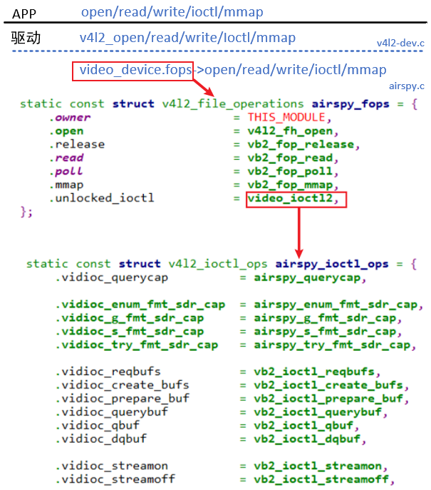
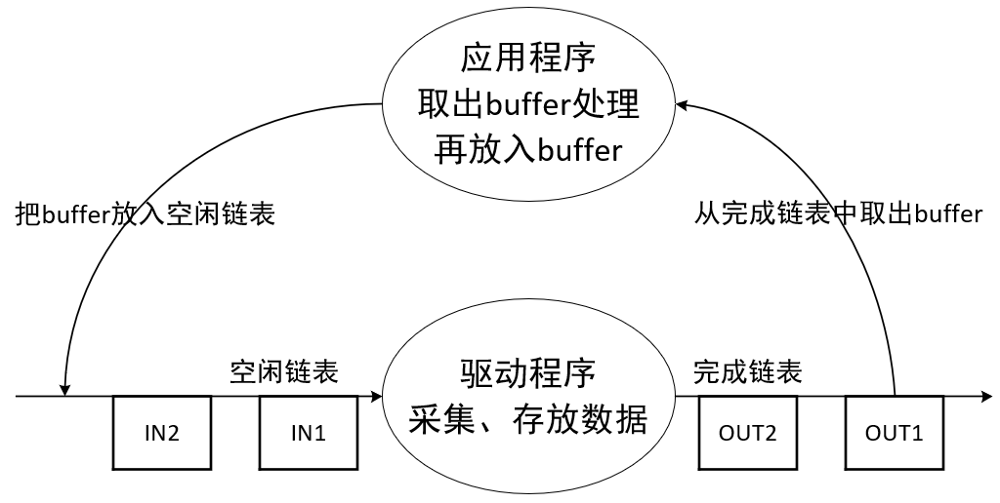
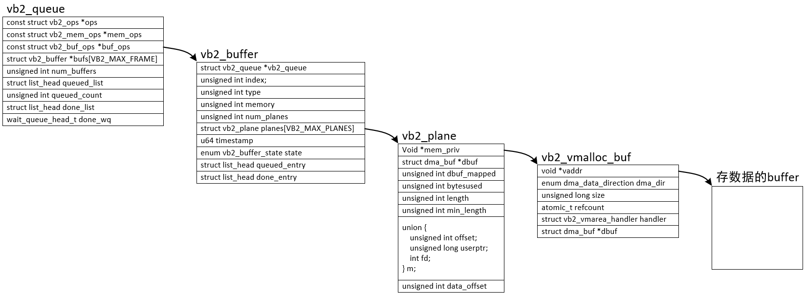
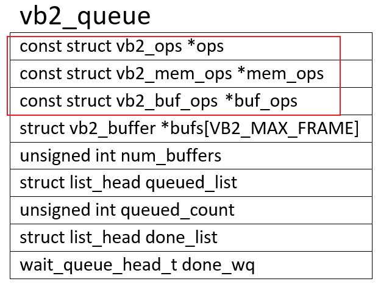
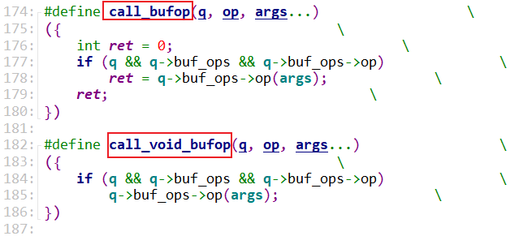
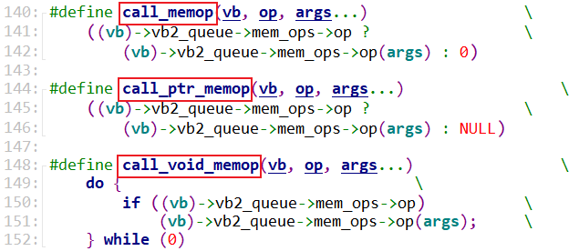
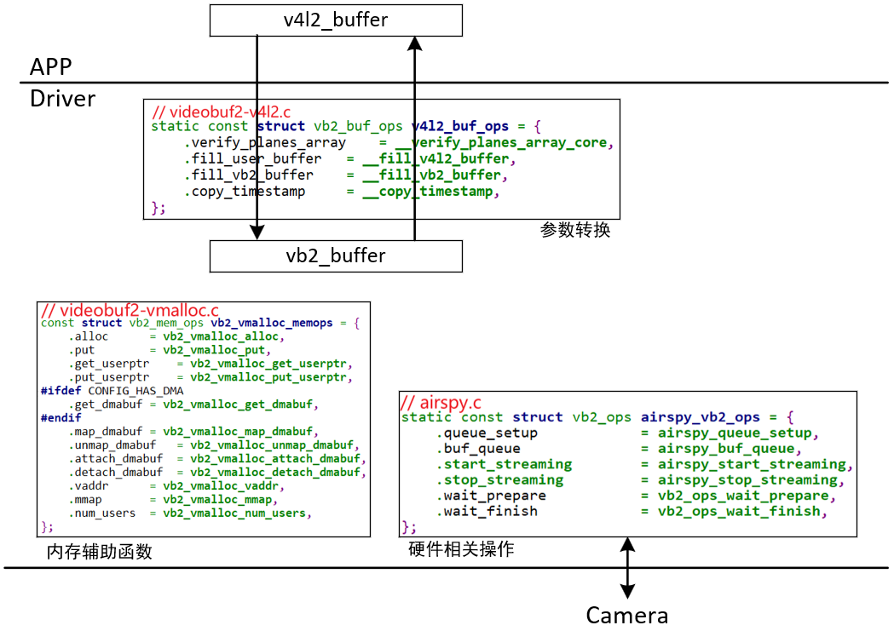

# V4L2驱动程序框架 #

参考资料：

* 深入理解linux内核v4l2框架之videobuf2：https://blog.csdn.net/yyjsword/article/details/9243717
* V4L2框架-videobuf2：https://blog.csdn.net/u013904227/article/details/81054611

## 1. 整体框架

* 字符设备驱动程序的核心是：file_operations结构体

* V4L2设备驱动程序的核心是：video_device结构体，它里面有2大成员
  * v4l2_file_operations结构体：实现具体的open/read/write/ioctl/mmap操作
  * v4l2_ioctl_ops结构体：v4l2_file_operations结构体一般使用video_ioctl2函数，它要调用v4l2_ioctl_ops结构体
  
  ```c
  /* note */
  从上到下分析,通过open 调用就会到已经注册的video_device的open 函数
      
  /*怎么写一个摄像头的驱动? */
  1. 初始一个video_device 结构体.里面的.fops指针指向硬件底层操作函数,以及初始化IO_ctrl 函数
  2. 初始化一个v4l2_device 结构体,里面有各种锁.
  3. video_device  指向这个v4l2_device 
  4. 注册video_device 结构体,接口层会注册一个字符设备,会有一个V4l2
  ```
  
  



### 1.1 V4L2驱动程序注册流程

参考`drivers\media\usb\airspy\airspy.c`：

```shell
static struct video_device airspy_template = {
	.name                     = "AirSpy SDR",
	.release                  = video_device_release_empty,
	.fops                     = &airspy_fops,
	.ioctl_ops                = &airspy_ioctl_ops,
};

// 分配/设置video_device结构体
s->vdev = airspy_template;

// 初始化一个v4l2_device结构体(起辅助作用)
/* Register the v4l2_device structure */
s->v4l2_dev.release = airspy_video_release;
ret = v4l2_device_register(&intf->dev, &s->v4l2_dev);

// video_device和4l2_device建立联系
s->vdev.v4l2_dev = &s->v4l2_dev;

// 注册video_device结构体
ret = video_register_device(&s->vdev, VFL_TYPE_SDR, -1);
		__video_register_device
			// 根据次设备号把video_device结构体放入数组
			video_device[vdev->minor] = vdev;
			
			// 注册字符设备驱动程序
			vdev->cdev->ops = &v4l2_fops;
			vdev->cdev->owner = owner;
			ret = cdev_add(vdev->cdev, MKDEV(VIDEO_MAJOR, vdev->minor), 1);

```


### 1.2 ioctl调用流程分析

#### 1.2.1 两类ioctl ==这里参考的都是airspy 的驱动==

底层驱动程序提供了很多ioctl的处理函数，比如：

```c
/* 定义了一个video_device 的设备,应该是这类设备都归属于video 设备 */
static struct video_device airspy_template = {
	.name                     = "AirSpy SDR",
	.release                  = video_device_release_empty,
	.fops                     = &airspy_fops,
	.ioctl_ops                = &airspy_ioctl_ops,
};
/*其中IO control 的函数集指向了v4l2的iocontrl 结构体,其中 struct v4l2_ioctl_ops 是一个有很多接口的结构体*/
static const struct v4l2_ioctl_ops airspy_ioctl_ops = {
	.vidioc_querycap          = airspy_querycap,

	.vidioc_enum_fmt_sdr_cap  = airspy_enum_fmt_sdr_cap,
	.vidioc_g_fmt_sdr_cap     = airspy_g_fmt_sdr_cap,
	.vidioc_s_fmt_sdr_cap     = airspy_s_fmt_sdr_cap,
	.vidioc_try_fmt_sdr_cap   = airspy_try_fmt_sdr_cap,
 
	.vidioc_reqbufs           = vb2_ioctl_reqbufs,
	.vidioc_create_bufs       = vb2_ioctl_create_bufs,
	.vidioc_prepare_buf       = vb2_ioctl_prepare_buf,
	.vidioc_querybuf          = vb2_ioctl_querybuf,
	.vidioc_qbuf              = vb2_ioctl_qbuf,
	.vidioc_dqbuf             = vb2_ioctl_dqbuf,

	.vidioc_streamon          = vb2_ioctl_streamon,
	.vidioc_streamoff         = vb2_ioctl_streamoff,

	.vidioc_g_tuner           = airspy_g_tuner,
	.vidioc_s_tuner           = airspy_s_tuner,

	.vidioc_g_frequency       = airspy_g_frequency,
	.vidioc_s_frequency       = airspy_s_frequency,
	.vidioc_enum_freq_bands   = airspy_enum_freq_bands,

	.vidioc_subscribe_event   = v4l2_ctrl_subscribe_event,
	.vidioc_unsubscribe_event = v4l2_event_unsubscribe,
	.vidioc_log_status        = v4l2_ctrl_log_status,
};
/* v4l2_ioctl_ops 定义了很多函数指针接口 */
struct v4l2_ioctl_ops {
	/* ioctl callbacks */
	/* VIDIOC_QUERYCAP handler */
	int (*vidioc_querycap)(struct file *file, void *fh, struct v4l2_capability *cap);
	/* VIDIOC_ENUM_FMT handlers */
	int (*vidioc_enum_fmt_vid_cap)     (struct file *file, void *fh,
			...
			...
            ...
	/* For other private ioctls */
	long (*vidioc_default)	       (struct file *file, void *fh,
					bool valid_prio, unsigned int cmd, void *arg);
};


```

这些`v4l2_ioctl_ops`被分为2类：

* INFO_FL_STD：标准的，无需特殊的代码来处理，APP的调用可以直达这些处理函数
* INFO_FL_FUNC：这类ioctl需要特殊处理，比如对于`VIDIOC_ENUM_FMT`，它需要根据设备的类型分别枚举：==对于不同的摄像头要枚举不同的函数==
  


简单地说，这2类ioctl的差别在于：

* INFO_FL_STD：APP发出的ioctl直接调用底层的video_device->ioctl_ops->xxxx(....)
* INFO_FL_FUNC：APP发出的ioctl，交给`drivers\media\v4l2-core\v4l2-ioctl.c`，它先进行一些特殊处理后，再调用底层的video_device->ioctl_ops->xxxx(....)

 

怎么区分这些ioctl呢？`drivers\media\v4l2-core\v4l2-ioctl.c`中有个数组,可见定义了两种宏定义,分别对应为`IOCTL_INFO_STD`和`IOCTL_INFO_FNC`标准和需要处理的IO 函数,其中是`flag`的标志位不同.

```c
#define IOCTL_INFO_STD(_ioctl, _vidioc, _debug, _flags)			\
	[_IOC_NR(_ioctl)] = {						\
		.ioctl = _ioctl,					\
		.flags = _flags | INFO_FL_STD,				\
		.name = #_ioctl,					\
		.u.offset = offsetof(struct v4l2_ioctl_ops, _vidioc),	\
		.debug = _debug,					\
	}

#define IOCTL_INFO_FNC(_ioctl, _func, _debug, _flags)			\
	[_IOC_NR(_ioctl)] = {						\
		.ioctl = _ioctl,					\
		.flags = _flags | INFO_FL_FUNC,				\
		.name = #_ioctl,					\
		.u.func = _func,					\
		.debug = _debug,					\
	}
而对于这个名称又是有: 
/* 其实本质上还是依赖这个数组，里面每一项对于的是这个数组的实现 */
struct v4l2_ioctl_info {
	unsigned int ioctl;
	u32 flags;
	const char * const name;
	union {
		u32 offset;
		int (*func)(const struct v4l2_ioctl_ops *ops,
				struct file *file, void *fh, void *p);
	} u;
	void (*debug)(const void *arg, bool write_only);
};

static struct v4l2_ioctl_info v4l2_ioctls[] = {
	IOCTL_INFO_FNC(VIDIOC_QUERYCAP, v4l_querycap, v4l_print_querycap, 0),
	IOCTL_INFO_STD(VIDIOC_G_STD, vidioc_g_std, v4l_print_std, 0),
    ......
}
```

这里用到了一个数组初始化的用法，所以前面的`[_IOC_NR(_ioctl)]`只是确定位置。

```c
[index] = { ... } 的作用
在 C 语言中，数组初始化时使用 [index] = value 语法，可以指定初始化特定索引处的元素。例如：
int array[10] = { [2] = 5, [7] = 9 };
```

这个数组里，每一项都表示一个ioctl：

#### 1.2.2 调用流程

APP调用摄像头的ioctl，流程为：

**首先要知道字符设备的IOctl 调用关系，这里用了v4l2框架**

```c
static const struct file_operations v4l2_fops = {
	.owner = THIS_MODULE,
	.read = v4l2_read,
	.write = v4l2_write,
	.open = v4l2_open,
	.get_unmapped_area = v4l2_get_unmapped_area,
	.mmap = v4l2_mmap,
	.unlocked_ioctl = v4l2_ioctl,
#ifdef CONFIG_COMPAT
	.compat_ioctl = v4l2_compat_ioctl32,
#endif
	.release = v4l2_release,
	.poll = v4l2_poll,
	.llseek = no_llseek,
};

/* 调用v4l2_ioctl 函数处理 vdev->fops->unlocked_ioctl  */
static long v4l2_ioctl(struct file *filp, unsigned int cmd, unsigned long arg)
{
	struct video_device *vdev = video_devdata(filp);
	int ret = -ENODEV;

	if (vdev->fops->unlocked_ioctl) {
		struct mutex *lock = v4l2_ioctl_get_lock(vdev, cmd);

		if (lock && mutex_lock_interruptible(lock))
			return -ERESTARTSYS;
		if (video_is_registered(vdev))
			ret = vdev->fops->unlocked_ioctl(filp, cmd, arg);/*调用unlocked_ioctl ioctl,其实就是调用 vdev->fops->unlocked_ioctl 函数*/
		if (lock)
			mutex_unlock(lock);
	} else if (vdev->fops->ioctl) {
                    ...
                    ...
		struct mutex *m = &vdev->v4l2_dev->ioctl_lock;

		if (cmd != VIDIOC_DQBUF && mutex_lock_interruptible(m))
			return -ERESTARTSYS;
		if (video_is_registered(vdev))
			ret = vdev->fops->ioctl(filp, cmd, arg);
		if (cmd != VIDIOC_DQBUF)
			mutex_unlock(m);
	} else
		ret = -ENOTTY;
	return ret;
}
```

再结合实际的`vedio_device `的多媒体设备定义，以`airspy_fops`函数为例，就是调用`video_ioctl2`

```c
static struct video_device airspy_template = {
	.name                     = "AirSpy SDR",
	.release                  = video_device_release_empty,
	.fops                     = &airspy_fops,
	.ioctl_ops                = &airspy_ioctl_ops,
};
static const struct v4l2_file_operations airspy_fops = {
	.owner                    = THIS_MODULE,
	.open                     = v4l2_fh_open,
	.release                  = vb2_fop_release,
	.read                     = vb2_fop_read,
	.poll                     = vb2_fop_poll,
	.mmap                     = vb2_fop_mmap,
	.unlocked_ioctl           = video_ioctl2,
};

long video_ioctl2(struct file *file,
	       unsigned int cmd, unsigned long arg)
{
	return video_usercopy(file, cmd, arg, __video_do_ioctl);
}
```

于是`video_usercopy`函数最后就是调用了`err = func(file, cmd, parg);`调用`__video_do_ioctl`函数，然后在`__video_do_ioctl`函数中对IO函数接口分类处理。

```c
if (info->flags & INFO_FL_STD) {
		typedef int (*vidioc_op)(struct file *file, void *fh, void *p);
		const void *p = vfd->ioctl_ops;
		const vidioc_op *vidioc = p + info->u.offset;/* 这里是能够根据偏移和offset 找到对应的处理函数 */
		ret = (*vidioc)(file, fh, arg);	/*调用*/
	} else if (info->flags & INFO_FL_FUNC) {
		ret = info->u.func(ops, file, fh, arg); /*调用vedio处理函数,这个是需要处理的*/ 
	} else if (!ops->vidioc_default) {
		ret = -ENOTTY;
	} else {
		ret = ops->vidioc_default(file, fh,
			vfh ? v4l2_prio_check(vfd->prio, vfh->prio) >= 0 : 0, 
			cmd, arg);
	}
```


### 1.3 buffer的内核实现

APP操作buffer的示意图如下：



驱动程序中如何管理这些buffer呢？


#### 1.3.1 videobuffer2缓冲区结构体




```c
/*note */
用两个队列来管理buffer
```


分配流程：

* 驱动程序初始化时，就构造了vb2_queue，这是"buffer的队列"，一开始里面没有"buffer"
* APP调用ioctl VIDIOC_REQBUFS向驱动申请N个buffer
* 驱动程序分配n(n<=N)个vb2_buffer结构体，然后
  * 对于普通摄像头，还分配一个vb2_plane结构体、vb2_vmalloc_buf结构体，最后分配存数据的buffer
  * 对于多平面摄像头，给每个vb2_buffer分配多个"vb2_plane结构体、vb2_vmalloc_buf结构体、存数据的buffer"


入队列流程：

* APP调用ioctl VIDIOC_QBUF
* 驱动程序根据其index找到vb2_buffer
* 把这个vb2_buffer放入链表vb2_queue.queued_list

硬件驱动接收到数据后，比如URB传输完成后：

* 从链表vb2_queue.queued_list找到(但是不移除)vb2_buffer
* 把硬件数据存入vb2_buffer
* 把vb2_buffer放入链表vb2_queue.done_list

出队列流程：

* APP调用ioctl VIDIOC_DQBUF
* 驱动程序从链表vb2_queue.done_list取出并移除第1个vb2_buffer
* 驱动程序也把这个vb2_buffer从链表vb2_queue.queued_list移除


#### 1.3.2 videobuffer2的3个ops

V4L2中使用vb2_queue来管理缓冲区，里面有3个操作结构体：`openev 的linux 版本少了buf_ops 的操作结构体`



```c
/*note*/
1. 用户只需要给一个index 就可以了。但是入队列，出队列都没有处理
2. 怎么从v4l2_buffer（user） 到 vb2_buffer(driver),怎么填充的-> 这个就是vb2_buf_ops 的作用。
    
3. 用户在使用v4l2_buffer的结构体类型的时候，是需要指定内存类型的(详情可见v4l2_buffer的结构体)，对于这些memery 相关的处理就是由`struct vb2_mem_ops`函数结构体处理。
    
    
4. 和硬件相关的操作-硬件相关的驱动程序,都在`struct vb2_ops` 的结构函数接口
    
```

* 内存相关操作函数接口

```c
const struct vb2_mem_ops vb2_vmalloc_memops = {
	.alloc		= vb2_vmalloc_alloc,
	.put		= vb2_vmalloc_put,
	.get_userptr	= vb2_vmalloc_get_userptr,
	.put_userptr	= vb2_vmalloc_put_userptr,
#ifdef CONFIG_HAS_DMA
	.get_dmabuf	= vb2_vmalloc_get_dmabuf,
#endif
	.map_dmabuf	= vb2_vmalloc_map_dmabuf,
	.unmap_dmabuf	= vb2_vmalloc_unmap_dmabuf,
	.attach_dmabuf	= vb2_vmalloc_attach_dmabuf,
	.detach_dmabuf	= vb2_vmalloc_detach_dmabuf,
	.vaddr		= vb2_vmalloc_vaddr,
	.mmap		= vb2_vmalloc_mmap,
	.num_users	= vb2_vmalloc_num_users,
};
```

* 硬件相关的函数接口，在这里需要把buffer 传递给硬件，控制对应的IP.

```c
static struct vb2_ops airspy_vb2_ops = {
	.queue_setup            = airspy_queue_setup,
	.buf_queue              = airspy_buf_queue,
	.start_streaming        = airspy_start_streaming,
	.stop_streaming         = airspy_stop_streaming,
	.wait_prepare           = vb2_ops_wait_prepare,
	.wait_finish            = vb2_ops_wait_finish,
};
```

==完整的注册流程==

* 构造了一个vb2_queue 结构体，分别给`ops`,`mem_ops` 分配对应的驱动函数
* 然后把`vedio device  `结构体的vb_queue 结构体指针的queue 类型，指向新构造的`vb2_queue`or`vb_queue`

```c
	/* Init videobuf2 queue structure */
	s->vb_queue.type = V4L2_BUF_TYPE_SDR_CAPTURE;
	s->vb_queue.io_modes = VB2_MMAP | VB2_USERPTR | VB2_READ;
	s->vb_queue.drv_priv = s;
	s->vb_queue.buf_struct_size = sizeof(struct airspy_frame_buf);
	s->vb_queue.ops = &airspy_vb2_ops;
	s->vb_queue.mem_ops = &vb2_vmalloc_memops;
	s->vb_queue.timestamp_flags = V4L2_BUF_FLAG_TIMESTAMP_MONOTONIC;
	ret = vb2_queue_init(&s->vb_queue);
	if (ret) {
		dev_err(s->dev, "Could not initialize vb2 queue\n");
		goto err_free_mem;
	}
	/* Init video_device structure */
	s->vdev = airspy_template;
	s->vdev.queue = &s->vb_queue;
	s->vdev.queue->lock = &s->vb_queue_lock;
	video_set_drvdata(&s->vdev, s);
```


这3个操作结构体的作用为：

* `const struct vb2_buf_ops *buf_ops`：在用户空间、内核空间之间传递buffer信息，通过下面几个宏来调用
  
* `const struct vb2_mem_ops *mem_ops`：分配内存用的回调函数，通过下面几个宏来调用
  

* `const struct vb2_ops *ops`：硬件相关的回调函数，通过下面几个宏来调用
  


这3个ops的层次图如下：




完整的注册流程(参考`drivers\media\usb\airspy\airspy.c`)：

```shell
static struct video_device airspy_template = {
	.name                     = "AirSpy SDR",
	.release                  = video_device_release_empty,
	.fops                     = &airspy_fops,
	.ioctl_ops                = &airspy_ioctl_ops,
};

/* 构造一个vb2_queue */
	/* Init videobuf2 queue structure */
	s->vb_queue.type = V4L2_BUF_TYPE_SDR_CAPTURE;
	s->vb_queue.io_modes = VB2_MMAP | VB2_USERPTR | VB2_READ;
	s->vb_queue.drv_priv = s;
	s->vb_queue.buf_struct_size = sizeof(struct airspy_frame_buf);
	s->vb_queue.ops = &airspy_vb2_ops;          // vb2_ops, 硬件相关的操作函数
	s->vb_queue.mem_ops = &vb2_vmalloc_memops;  // vb2_mem_ops, 辅助结构体,用于mem ops(alloc、mmap)
	s->vb_queue.timestamp_flags = V4L2_BUF_FLAG_TIMESTAMP_MONOTONIC;
	ret = vb2_queue_init(&s->vb_queue);
				q->buf_ops = &v4l2_buf_ops;    // vb2_buf_ops, 用于APP和驱动传递参数

// 分配/设置video_device结构体
s->vdev = airspy_template;
s->vdev.queue = &s->vb_queue;    // 指向前面构造的vb2_queue

// 初始化一个v4l2_device结构体(起辅助作用)
/* Register the v4l2_device structure */
s->v4l2_dev.release = airspy_video_release;
ret = v4l2_device_register(&intf->dev, &s->v4l2_dev);

// video_device和4l2_device建立联系
s->vdev.v4l2_dev = &s->v4l2_dev;

// 注册video_device结构体
ret = video_register_device(&s->vdev, VFL_TYPE_SDR, -1);
		__video_register_device
			// 根据次设备号把video_device结构体放入数组
			video_device[vdev->minor] = vdev;
			
			// 注册字符设备驱动程序
			vdev->cdev->ops = &v4l2_fops;
			vdev->cdev->owner = owner;
			ret = cdev_add(vdev->cdev, MKDEV(VIDEO_MAJOR, vdev->minor), 1);

```


#### 1.3.3 vb2_buf_ops

`struct vb2_buf_ops`示例如下：


原型如下：

```c
struct vb2_buf_ops {
	int (*verify_planes_array)(struct vb2_buffer *vb, const void *pb);
	void (*fill_user_buffer)(struct vb2_buffer *vb, void *pb);
	int (*fill_vb2_buffer)(struct vb2_buffer *vb, const void *pb,
				struct vb2_plane *planes);
	void (*copy_timestamp)(struct vb2_buffer *vb, const void *pb);
};
```

各成员的作用为：

| vb2_buf_ops结构体成员 | 作用                                                         |
| --------------------- | ------------------------------------------------------------ |
| verify_planes_array   | APP调用ioctl VIDIOC_DQBUF时，在驱动内部会调用此函数，用来验证这个buffer含有足够多的plane。 |
| fill_user_buffer      | 使用驱动的vb2_buffer结构体来填充一个v4l2_buffer结构体，用来给用户空间提供更多信息。APP调用ioctl VIDIOC_QUERYBUF、VIDIOC_PREPARE_BUF、VIDIOC_QBUF、VIDIOC_DQBUF时，都会传入一个v4l2_buffer结构体。 |
| fill_vb2_buffer       | APP调用ioctl VIDIOC_QBUF时，传入一个v4l2_buffer结构体，驱动里会用它来填充vb2_buffer结构体。 |
| copy_timestamp        | APP调用ioctl VIDIOC_QBUF时，传入一个v4l2_buffer结构体，用户程序可以在它的timestamp里记下时间。驱动程序可以调用此函数把timestamp写入vb2_buffer.timestamp里。 |


#### 1.3.4 vb2_mem_ops

`struct vb2_mem_ops`示例如下：


原型如下：

```c
struct vb2_mem_ops {
	void		*(*alloc)(struct device *dev, unsigned long attrs,
				  unsigned long size,
				  enum dma_data_direction dma_dir,
				  gfp_t gfp_flags);
	void		(*put)(void *buf_priv);
	struct dma_buf *(*get_dmabuf)(void *buf_priv, unsigned long flags);

	void		*(*get_userptr)(struct device *dev, unsigned long vaddr,
					unsigned long size,
					enum dma_data_direction dma_dir);
	void		(*put_userptr)(void *buf_priv);

	void		(*prepare)(void *buf_priv);
	void		(*finish)(void *buf_priv);

	void		*(*attach_dmabuf)(struct device *dev,
					  struct dma_buf *dbuf,
					  unsigned long size,
					  enum dma_data_direction dma_dir);
	void		(*detach_dmabuf)(void *buf_priv);
	int		(*map_dmabuf)(void *buf_priv);
	void		(*unmap_dmabuf)(void *buf_priv);

	void		*(*vaddr)(void *buf_priv);
	void		*(*cookie)(void *buf_priv);

	unsigned int	(*num_users)(void *buf_priv);

	int		(*mmap)(void *buf_priv, struct vm_area_struct *vma);
};
```

各成员的作用为：

| vb2_mem_ops结构体成员 | 作用                                                         |
| --------------------- | ------------------------------------------------------------ |
| alloc                 | 分配真正用于存储视频数据的buffer，可能还分配私有数据         |
| put                   | 通知分配器：这块buffer不再使用了。通常会释放内存。           |
| get_dmabuf            | 获得DMA BUF给底层驱动使用                                    |
| get_userptr           | 如果存储视频数据的buffer是userptr（由APP提供），那么APP调用ioctl VIDIOC_QBUF时，需要传入APP的buffer指针。驱动程序内部通过此函数把用户空间的buffer映射到内核空间。 |
| put_userptr           | 通知分配器：这块USERPTR缓冲区不再使用                        |
| attach_dmabuf         | 如果存储视频数据的buffer是DMA Buf，那么在把这个buffer放入队列前会调用此函数：记录这个DMA Buf。 |
| detach_dmabuf         | 不再使用这个DMA Buf时，做些清理工作（比如在attach_dmabuf里分配了数据，就在这里释放掉） |
| map_dmabuf            | 把DMA Buf映射到内核空间                                      |
| unmap_dmabuf          | map_dmabuf的反操作                                           |
| prepare               | 每当buffer被从用户空间传递到驱动时，此函数被调用，可以用来做某些同步操作。可选。 |
| finish                | 每当buffer被从驱动传递到用户空间时，此函数被调用，可以用来做某些同步操作。可选。 |
| vaddr                 | 返回这块内存的内核空间地址                                   |
| cookie                | 没什么用                                                     |
| num_users             | 返回这块内存的引用计数                                       |
| mmap                  | 把这块内存，映射到用户空间                                   |


#### 1.3.5 vb2_ops

`struct vb2_ops`示例如下：


原型如下：

```c
struct vb2_ops {
	int (*queue_setup)(struct vb2_queue *q,
			   unsigned int *num_buffers, unsigned int *num_planes,
			   unsigned int sizes[], struct device *alloc_devs[]);

	void (*wait_prepare)(struct vb2_queue *q);
	void (*wait_finish)(struct vb2_queue *q);

	int (*buf_init)(struct vb2_buffer *vb);
	int (*buf_prepare)(struct vb2_buffer *vb);
	void (*buf_finish)(struct vb2_buffer *vb);
	void (*buf_cleanup)(struct vb2_buffer *vb);

	int (*start_streaming)(struct vb2_queue *q, unsigned int count);
	void (*stop_streaming)(struct vb2_queue *q);

	void (*buf_queue)(struct vb2_buffer *vb);
};
```

各成员的作用为：

| vb2_ops结构体成员 | 作用                                                         |
| ----------------- | ------------------------------------------------------------ |
| queue_setup       | APP调用ioctl VIDIOC_REQBUFS或VIDIOC_CREATE_BUFS时，<br />驱动程序在分配内存之前，会调用此函数。<br />作用：通过它来询问硬件驱动"你需要多少个buffer？每个buffer需要多少个plane？"<br />这个函数被调用2次：第1次用来表明驱动程序对buffer的需求，但是不一定能全部分配这些buffer，当分配出buffer后，再调用第2次以验证"这些buffer是否足够"。 |
| wait_prepare      | 释放驱动自己的互斥锁                                         |
| wait_finish       | 申请驱动自己的互斥锁                                         |
| buf_init          | 分配vb2_buffer及它内部存储数据的buffer后，使用buf_init进行驱动相关的初始化 |
| buf_prepare       | APP调用ioctl VIDIOC_QBUF或VIDIOC_PREPARE_BUF时，驱动程序会在执行硬件操作前，调用此函数进行必要的初始化。 |
| buf_finish        | APP调用ioctl VIDIOC_DQBUF后，在驱动程序返回用户空间之前，会调用此函数，可以在这个函数里修改buffer。或者驱动程序内部停止或暂停streaming时，也会调用此函数。 |
| buf_cleanup       | 在buffer被释放前调用，驱动程序在这个函数里执行额外的清除工作。 |
| start_streaming   | 驱动相关的"启动streaming"函数                                |
| stop_streaming    | 驱动相关的"停止streaming"函数                                |
| buf_queue         | 把buffer传送给驱动，驱动获得数据、填充好buffer后会调用vb2_buffer_done函数返还buffer。 |


#### 1.3.6 videobuffer2情景分析

情景分析1：申请buffer

```c
APP ioctl VIDIOC_REQBUFS
------------------------------
	v4l_reqbufs // v4l2-ioctl.c
    	ops->vidioc_reqbufs(file, fh, p);
			vb2_ioctl_reqbufs // videobuf2-v4l2.c
    			vb2_core_reqbufs 
                    /*
                     * Ask the driver how many buffers and planes per buffer it requires.
                     * Driver also sets the size and allocator context for each plane.
                     */
                    /* 调用硬件相关的vb2_ops.queue_setup，确认需要多少个buffer、每个buffer里有多少个plane */
                    ret = call_qop(q, queue_setup, q, &num_buffers, &num_planes,
                               plane_sizes, q->alloc_devs);


                    /* Finally, allocate buffers and video memory */					
                    allocated_buffers =
                        __vb2_queue_alloc(q, memory, num_buffers, num_planes, plane_sizes);
							ret = __vb2_buf_mem_alloc(vb);
										// 调用vb2_mem_ops.alloc分配内存
                                        mem_priv = call_ptr_memop(vb, alloc,
                                            q->alloc_devs[plane] ? : q->dev,
                                            q->dma_attrs, size, dma_dir, q->gfp_flags);

					/* 驱动想得到M个buffer，但是可能只分配了N个buffer，可以吗？问驱动
					 * 再次调用硬件相关的vb2_ops.queue_setup，确认已经分配的buffer个数、每个buffer的plane个数是否符合硬件需求
					 */
                    ret = call_qop(q, queue_setup, q, &num_buffers,
                               &num_planes, plane_sizes, q->alloc_devs);
```


情景分析2：把buffer放入队列

```c
APP ioctl VIDIOC_QBUF
------------------------------
	v4l_qbuf // v4l2-ioctl.c
    	ops->vidioc_qbuf(file, fh, p);
			vb2_ioctl_qbuf // videobuf2-v4l2.c
                vb2_qbuf(vdev->queue, p);  // videobuf2-v4l2.c
					vb2_core_qbuf(q, b->index, b); // videobuf2-core.c
						ret = __buf_prepare(vb, pb);
								ret = __qbuf_mmap(vb, pb);  // videobuf2-core.c

                                        if (pb) // 调用vb2_buf_ops.fill_vb2_buffer, 使用APP传入的v4l2_buffer来设置驱动的vb2_buffer
                                            ret = call_bufop(vb->vb2_queue, fill_vb2_buffer,
                                                     vb, pb, vb->planes);
										// 硬件相关的vb2_ops.buf_prepare, 对buffer做些准备工作
                                        return ret ? ret : call_vb_qop(vb, buf_prepare, vb);
						// 把buffer放入空闲链表
						list_add_tail(&vb->queued_entry, &q->queued_list);

                        if (pb) // 调用vb2_buf_ops.copy_timestamp, 使用APP传入的v4l2_buffer来设置驱动的vb2_buffer
                            call_void_bufop(q, copy_timestamp, vb, pb);

                        /*
                         * If already streaming, give the buffer to driver for processing.
                         * If not, the buffer will be given to driver on next streamon.
                         */
                        if (q->start_streaming_called)
                            __enqueue_in_driver(vb);
                                    /* sync buffers */
                                    for (plane = 0; plane < vb->num_planes; ++plane)
                                        // 调用vb2_mem_ops.prepare做准备
                                        call_void_memop(vb, prepare, vb->planes[plane].mem_priv); 

									// 调用硬件相关的vb2_ops.buf_queue把buffer传送给驱动
                                    call_void_vb_qop(vb, buf_queue, vb);

                        /* Fill buffer information for the userspace */
                        if (pb) // 调用vb2_buf_ops.fill_user_buffer, 使用驱动的vb2_buffer为APP设置v4l2_buffer
                            call_void_bufop(q, fill_user_buffer, vb, pb);

                        /*
                         * If streamon has been called, and we haven't yet called
                         * start_streaming() since not enough buffers were queued, and
                         * we now have reached the minimum number of queued buffers,
                         * then we can finally call start_streaming().
                         */
                        if (q->streaming && !q->start_streaming_called &&
                            q->queued_count >= q->min_buffers_needed) {
                            ret = vb2_start_streaming(q);
                                        /*
                                         * If any buffers were queued before streamon,
                                         * we can now pass them to driver for processing.
                                         */
                                        list_for_each_entry(vb, &q->queued_list, queued_entry)
                                            __enqueue_in_driver(vb);
                                                    /* sync buffers */
                                                    for (plane = 0; plane < vb->num_planes; ++plane)
                                                        // 调用vb2_mem_ops.prepare做准备
                                                        call_void_memop(vb, prepare, vb->planes[plane].mem_priv);
													// 调用硬件相关的vb2_ops.buf_queue把buffer传送给驱动
                                                    call_void_vb_qop(vb, buf_queue, vb);

                                        /* Tell the driver to start streaming */
                                        q->start_streaming_called = 1;
                            			// 调用硬件相关的vb2_ops.start_streaming启动硬件传输
                                        ret = call_qop(q, start_streaming, q,
                                                   atomic_read(&q->owned_by_drv_count));


```


情景分析3：把buffer取出队列

```shell
APP ioctl VIDIOC_DQBUF
------------------------------
	v4l_dqbuf // v4l2-ioctl.c
    	ops->vidioc_dqbuf(file, fh, p);
			vb2_ioctl_dqbuf // videobuf2-v4l2.c
				vb2_dqbuf(vdev->queue, p, file->f_flags & O_NONBLOCK);
					ret = vb2_core_dqbuf(q, NULL, b, nonblocking);
                            ret = __vb2_get_done_vb(q, &vb, pb, nonblocking);
                                    ret = __vb2_wait_for_done_vb(q, nonblocking);
                                            call_void_qop(q, wait_prepare, q);
                                            wait_event_interruptible
                                            call_void_qop(q, wait_finish, q);
                                    *vb = list_first_entry(&q->done_list, struct vb2_buffer, done_entry);
                                    if (pb)
                                        ret = call_bufop(q, verify_planes_array, *vb, pb);
                                                    __verify_planes_array_core
                                                        __verify_planes_array(vb, pb);
                                    if (!ret)
                                        list_del(&(*vb)->done_entry);			
                            call_void_vb_qop(vb, buf_finish, vb);

                            /* go back to dequeued state */
                            __vb2_dqbuf(vb);
                                call_void_memop(vb, unmap_dmabuf, vb->planes[i].mem_priv);
                                    vb2_vmalloc_unmap_dmabuf
                                        dma_buf_vunmap(buf->dbuf, buf->vaddr);
```


