# MIPI摄像头驱动程序分析 #

参考资料：

* 内核源码: `drivers\media\usb\uvc\uvc_driver.c`
* 全志 芯片 Linux MIPI CSI摄像头接口开发指南：https://blog.csdn.net/thisway_diy/article/details/128459836
* 瑞芯微rk3568平台摄像头控制器MIPI-CSI驱动架构梳理：https://zhuanlan.zhihu.com/p/621470492
* MIPI、CSI基础：https://zhuanlan.zhihu.com/p/599531271
* 全志T7 CSIC模块：https://blog.csdn.net/suwen8100/article/details/116226366
* 全志在线文档：https://v853.docs.aw-ol.com/soft/soft_camera/  
* 参考源码： https://gitee.com/juping_zheng1/v85x-mediactrl


## 1. 术语
| 术语 | 解释 |
| ---- | ---- |
|AE(Auto Exposure)|自动曝光|
|AF(Auto Focus)   |自动对焦|
|AWB(Auto White Balance)|自动白平衡|
|3A  |指自动曝光(AE)、自动对焦(AF)和自动白平衡(AWB)算法|
|Async Sub Device|在Media Controller结构下注册的V4L2异步子设备，例|Sensor、MIPI DPHY|
|Bayer Raw（或Raw Bayer）  |Bayer是相机内部的原始图片，一般后缀为.raw|.raw格式内部的存储方式有|RGGB、BGGR、GRBG等|
|CIF     |Rockchip芯片中的VIP模块，接收Sensor数据并保存到内存中，仅转存数据，无ISP功能|
|DVP(Digital Video Port)  |一种并行数据传输接口|
|Entity  |Media Controller架构下的各节点|
|Frame   |帧|
|HSYNC   |行同步信号，HSYNC有效时，接收到的信号属于同一行|
|IOMMU(Input Output Memory Management Unit)|Rockchip芯片中的IOMMU模块，用于将物理上分散的内存页映射成CIF、ISP可见的连续内存|
|IQ(Image Quality) |指为Bayer Raw Camera调试的IQ xml，用于3A tunning|
|ISP(Image Signal Processing) |图像信号处理|
|Media Controller |Linux内核中的一种媒体框架，用于拓扑结构的管理|
|MIPI-DPHY     |Rockchip芯片中符合MIPI-DPHY协议的控制器|
|MP(Main Path)|Rockchip芯片ISP驱动的一个输出节点，一般用来拍照和抓取Raw图|
|PCLK(Pixel Clock) |指Sensor输出的Pixel Clock|
|Pipeline          |Media Controller架构的各Entity之间相互连接形成的链路|
|SP(Self Patch)    |Rockchip芯片ISP驱动的一个输出节点|
|V4L2(Video4Linux2)   |指Linux内核的视频处理模块|
|VICAP(Video Capture) |视频捕获|
|VIP(Video Input Processor)|在Rockchip芯片中，曾作为CIF的别名|
|VSYNC  |场同步信号，VSYNC有效时，接收到的信号属于同一帧|


## 2. 硬件框架

### 2.1 接口

本文参考：https://zhuanlan.zhihu.com/p/599531271，作者"一口Linux"。

MIPI包含有很多协议，比如显示设备接口、摄像头设备接口、存储设备接口等等。

经常用到的有显示设备接口、摄像头设备接口。

显示设备接口又可以分为：并行接口、串行接口。并行接口又可以分为DBI、DPI。串行接口简称DSI。

摄像头设备接口常用串行接口CSI，它可分为CSI-2、CSI-3，目前常用的是CSI-2。对于CSI-2，它的物理接口分为D-PHY、C-PHY，目前常用的是D-PHY。(DSI使用的物理接口也是D-PHY)。

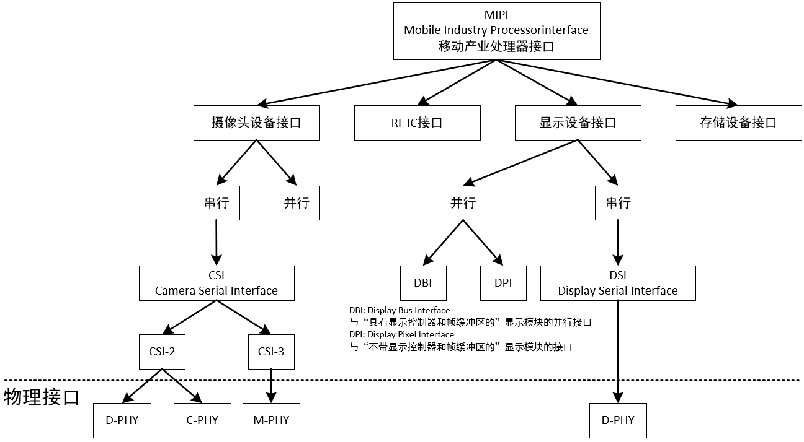

D-PHY接口引脚示例如下：

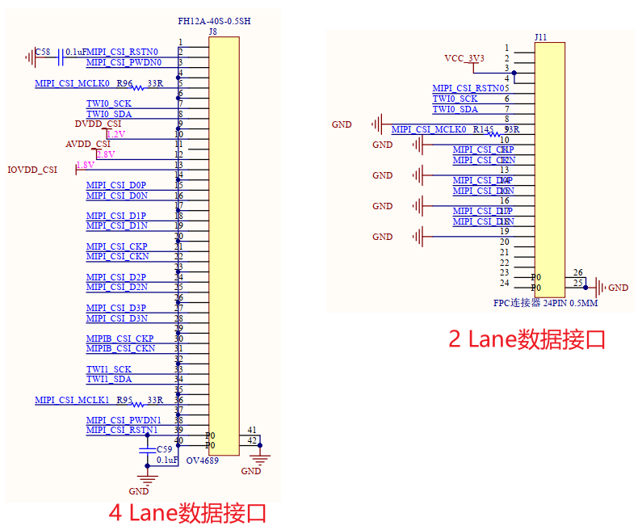


### 2.2 硬件结构

D-PHY接口典型图例如下：

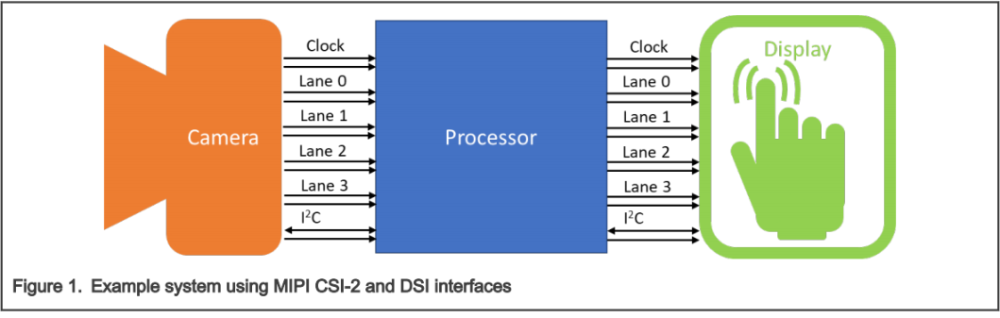


对于摄像头，D-PHY接口仅仅是用来传递数据：

* 摄像头发送数据，它被称为：CSI Transmitter
* 主控接收数据，它被称为：CSI Receiver
* 主控通过I2C接口发送控制命令，它被称为：CCI Master（CCI名为Camera Control Interface）
* 摄像头接收控制命令，它被称为：CCI Slave

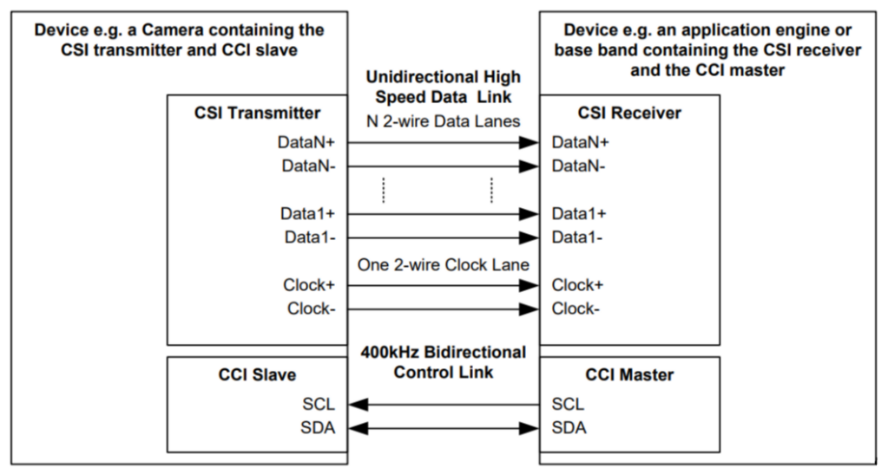


摄像头通过CSI接口，仅仅是传递数据给主控，主控还需要更多处理，如下图：

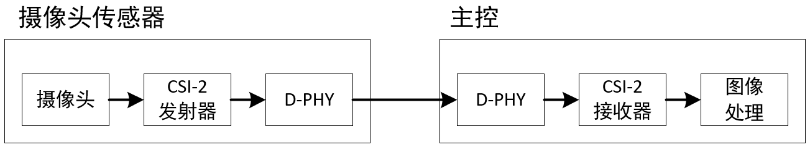


有哪些处理？

根据全志V853芯片资料，可以看到下图：

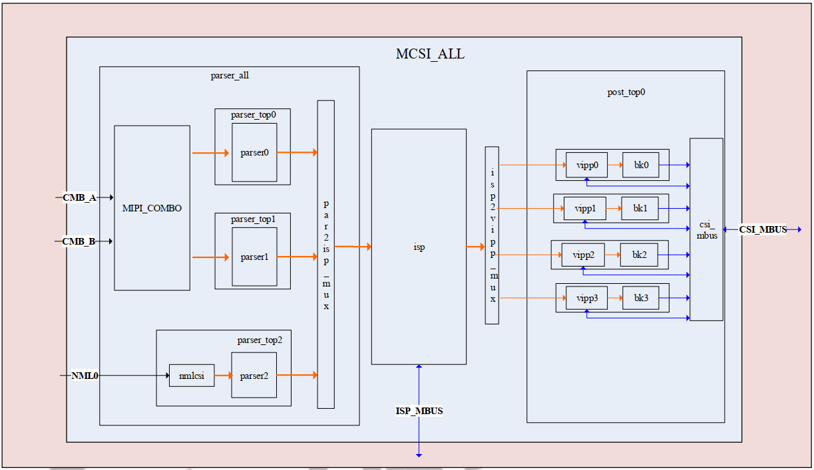

它的处理过程分为：

* 输入Parser：格式解析
* ISP：Image Signal Processor，即图像信号处理器，用于处理图像信号传感器输出的图像信号
* VIPP： Video Input Post Processor（视频输入后处理器），能对图片进行缩小和打水印处理。VIPP支持bayer raw data经过ISP处理后再缩小，也支持对一般的YUV格式的sensor图像直接缩小。


摄像头数据处理的完整硬件框图如下（以全志为例）：https://v853.docs.aw-ol.com/soft/soft_camera/

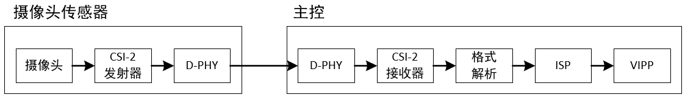

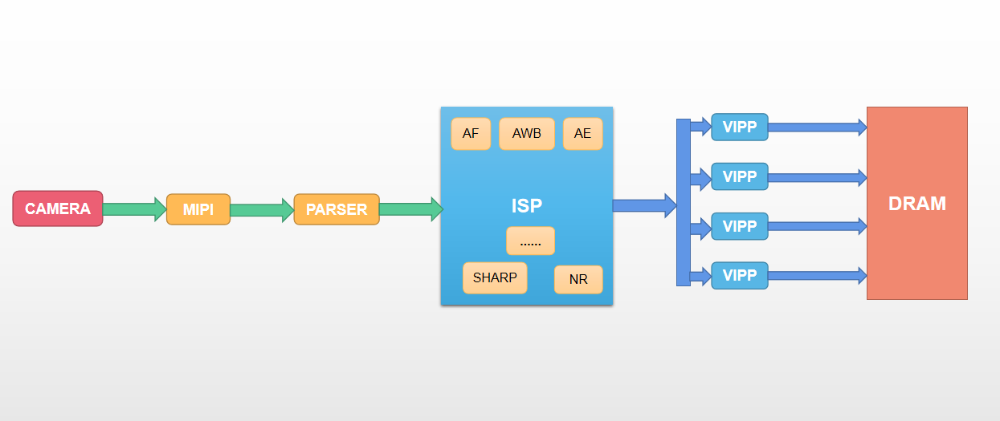

可以跟瑞芯微的对比一下：https://zhuanlan.zhihu.com/p/599531271


## 3. 开发环境搭建

IMX6ULL、STM32MP157上没有MIPI接口，我们使用V853开发板来讲解MIPI驱动。

要理解MIPI驱动，核心是subdev、media子系统，全网都没有关于它们的详细而系统的文档。而要想理解一个驱动，必须从这2方面学习：APP怎么使用、驱动如何实现。必须去阅读、分析真实板子的驱动，动手操作。

### 3.1 下载资料

V853所有资料都汇总于此：https://forums.100ask.net/t/topic/2986

获取网盘资料后，按照"01_学习手册"目录中的《100ASK-V853-Pro系统开发手册》安装虚拟机VMWare、打开Ubuntu虚拟机，上传解压源码。


### 3.2 编译/运行Hello

有3套工具链：

```shell
cd ~/tina-v853-open/prebuilt/rootfsbuilt/arm
find -name "*gcc"
```

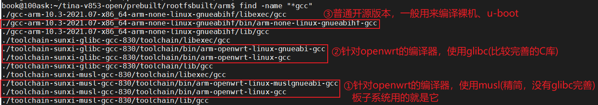

开发板/lib目录的库，来自工具链①，musl的C库比较精简，但是没有glibc完善。编译一般的APP是没问题的，但是编译v4l2-utils时会提示缺乏头文件。

对于简单的APP，建议使用工具链①：

对于复杂的APP，如果使用工具链①无法编译，就使用工具链②，它含有glibc要静态链接。


使用工具链①：

```shel
export PATH=$PATH:/home/book/tina-v853-open/prebuilt/rootfsbuilt/arm/toolchain-sunxi-musl-gcc-830/toolchain/bin
export STAGING_DIR=/home/book/tina-v853-open/prebuilt/rootfsbuilt/arm/toolchain-sunxi-musl-gcc-830/toolchain/arm-openwrt-linux-muslgnueabi

arm-openwrt-linux-muslgnueabi-gcc -o hello hello.c
```


使用工具链②：

```shell
export PATH=$PATH:/home/book/tina-v853-open/prebuilt/rootfsbuilt/arm/toolchain-sunxi-glibc-gcc-830/toolchain/bin

export STAGING_DIR=/home/book/tina-v853-open/prebuilt/rootfsbuilt/arm/toolchain-sunxi-glibc-gcc-830/toolchain/arm-openwrt-linux-gnueabi

arm-openwrt-linux-gnueabi-gcc -o hello2 hello.c -static
```


放到板子上去，在Ubuntu执行如下命令：

```shell
adb push hello /root
```

在板子上运行：

```shell
/root/hello
```


在Ubuntu中无法识别adb设备的解决方法：

https://blog.csdn.net/xiaowang_lj/article/details/133682416

```shell
sudo vi /etc/udev/rules.d/51-android.rules 
# 增加如下内容
SUBSYSTEM=="usb", ATTRS{idVendor}=="18d1", ATTRS{idProduct}=="d002",MODE="0666",GROUP="plugdev"

sudo service udev restart
sudo adb kill-server
adb devices
```


### 3.3 更换单板系统


#### 3.3.1 重烧系统

V853开发板出厂自带的系统，里面的文件比如/lib，使用的是musl C库。musl是个精简的C库，功能受限，无法运行v4l-utils。

我们需要更换系统，新系统使用glibc库，里面已经集成了v41-utils。可以参考"100ASK-V853_Pro系统开发手册.pdf"里《4.5.1 烧录EMMC系统》，烧写GIT仓库里如下文件：

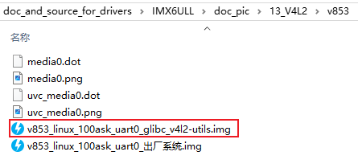


#### 3.3.2 体验v4l-utils

在板子上：

```shell
# 先运行camerademo
camerademo

# 否则下面的命令会崩溃
media-ctl -p -d /dev/media0
media-ctl -d /dev/media0 --print-dot > media0.dot
```


Ubuntu上：

```shell
sudo apt install  xdot
adb pull /root/media0.dot
dot -Tpng media0.dot -o media0.png
```


Ubuntu上测试USB摄像头：

```shell
cd ~/v4l-utils-1.20.0
./configure
make
sudo make install

su root
media-ctl -p -d /dev/media0
media-ctl -d /dev/media0 --print-dot > uvc_media0.dot
dot -Tpng uvc_media0.dot -o uvc_media0.png
```


### 3.4 自己制作单板系统

我们的目的是使用v4l-utils，它依赖于glibc库。所以：

* 步骤1：使用glibc的工具链编译v4l-utils
* 步骤2：把编译好的v4l-utils文件放入v853的SDK包里
* 步骤3：编译、打包v853映像文件

#### 3.4.1 编译v4l-utils

官网：http://linuxtv.org/downloads/v4l-utils

下载地址：https://linuxtv.org/downloads/v4l-utils/v4l-utils-1.20.0.tar.bz2

编译命令：

```shell
#export PATH=$PATH:/home/book/tina-v853-open/prebuilt/rootfsbuilt/arm/toolchain-sunxi-musl-gcc-830/toolchain/bin
#export STAGING_DIR=/home/book/tina-v853-open/prebuilt/rootfsbuilt/arm/toolchain-sunxi-musl-gcc-830/toolchain/arm-openwrt-linux-muslgnueabi

# 使用GLIBC的工具链
export PATH=$PATH:/home/book/tina-v853-open/prebuilt/rootfsbuilt/arm/toolchain-sunxi-glibc-gcc-830/toolchain/bin

export STAGING_DIR=/home/book/tina-v853-open/prebuilt/rootfsbuilt/arm/toolchain-sunxi-glibc-gcc-830/toolchain/arm-openwrt-linux-gnueabi

wget https://linuxtv.org/downloads/v4l-utils/v4l-utils-1.20.0.tar.bz2
tar xjf v4l-utils-1.20.0.tar.bz2
cd ~/v4l-utils-1.20.0
./configure --host=arm-openwrt-linux-gnueabi --prefix=$PWD/tmp --with-udevdir=$PWD/tmp
make  # 有错也没关系

make install

# 在tmp目录下生成了如下文件
book@100ask:~/v4l-utils-1.20.0$ ls tmp/
bin  etc  include  lib  rc_keymaps  rules.d  sbin  share
```


#### 3.4.2 把文件放入SDK

复制文件: 

```shell
#把v4l-utils的tmp/bin, tmp/lib复制到如下目录:
# /home/book/tina-v853-open/openwrt/target/v853/v853-100ask/busybox-init-base-files

cd ~/v4l-utils-1.20.0/tmp
cp bin /home/book/tina-v853-open/openwrt/target/v853/v853-100ask/busybox-init-base-files -rf
cp lib /home/book/tina-v853-open/openwrt/target/v853/v853-100ask/busybox-init-base-files -rf

# 删除单板无需使用的文件
cd /home/book/tina-v853-open/openwrt/target/v853/v853-100ask/busybox-init-base-files/lib
rm *.a
rm *.la
```


修改文件: ~/tina-v853-open/openwrt/package/allwinner/system/busybox-init-base-files/Makefile

增加以下内容(不增加以下内容的话，在tina-v853-open中make时，会提示找不到依赖文件):

```shell
define Package/$(PKG_NAME)/extra_provides
        echo 'libstdc++.so.6'
endef
```


#### 3.4.3 制作映像

要自己制作映像文件的话，操作方法如下：

```shell
# 上传SDK,解压得到tina-v853-open目录
book@100ask:~$ cat tina-v853-open.tar.gz* | tar xz

# 下载补丁包
book@100ask:~$ git clone https://github.com/DongshanPI/100ASK_V853-PRO_TinaSDK.git
book@100ask:~$ cp -rfvd 100ASK_V853-PRO_TinaSDK/* tina-v853-open/
book@100ask:~$ cd tina-v853-open/

# 配置
~/tina-v853-open$ source build/envsetup.sh

# 选择
~/tina-v853-open$ lunch
ou're building on Linux
Lunch menu... pick a combo:
1 v853-100ask-tina
2 v853-vision-tina
Which would you like? [Default v853-100ask]: 1

# 重新配置使用glibc的工具链
~/tina-v853-open$ make menuconfig
-> Advanced configuration options (for developers)
  -> Use external toolchain 
     -> Use host's toolchain 
        -> Toolchain root # 设置为: $(LICHEE_TOP_DIR)/prebuilt/rootfsbuilt/arm/toolchain-sunxi-glibc-gcc-830/toolchain 
        -> Toolchain libc # 选择glibc

# 编译
~/tina-v853-open$ make -j 16

# 制作映像文件
~/tina-v853-open$ pack

# 提示分区太小
ERROR: dl file rootfs.fex size too large
ERROR: filename = rootfs.fex
ERROR: dl_file_size = 46848 sector
ERROR: part_size = 45824 sector
update_for_part_info -1
ERROR: update mbr file fail
ERROR: update_mbr failed

# 修改分区大小
vi ./device/config/chips/v853/configs/100ask/linux-4.9/sys_partition.fex

[partition]
    name         = rootfs
    size         = 47000  # 从45824改为47000
    downloadfile = "rootfs.fex"
    user_type    = 0x8000

# 再重新pack
~/tina-v853-open$ pack

# 得到如下文件:
34M     /home/book/tina-v853-open/out/v853/100ask/openwrt/v853_linux_100ask_uart0.img
```

配置界面如下图所示：

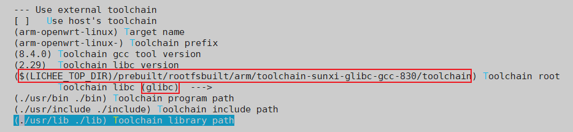


## 4. subdev和media子系统

### 4.1 subdev和media子系统的引入

#### 4.1.1 subdev的引入

##### 1. 简单驱动

对于比较简单的摄像头，我们把它当做一个整体，它的核心就是一个video_device。以前面讲过的虚拟驱动程序为例，它的源码位于如下目录：

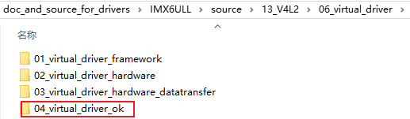

这个驱动程序的核心是video_device，如下：

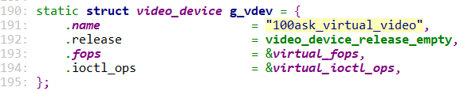

在整个驱动程序中，没有subdev，没有media子系统。


##### 2. UVC驱动

USB摄像头稍微复杂一点，它的内部有各类Unit或Terminal，如下图所示：

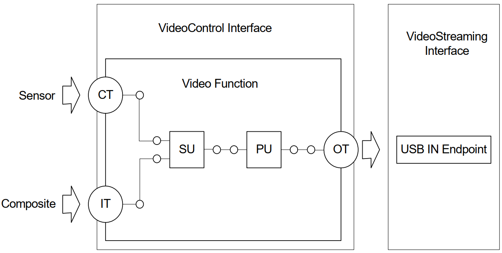

但是这些Unit或Terminal的独立性不强，并且它们遵守UVC规范，没必要单独为它们编写驱动程序。在UVC驱动程序里，每一个Unit或Terminal都有一个"struct uvc_entity"结构体，每一个"struct uvc_entity"里面也都有一个"struct v4l2_subdev"，如下图所示：

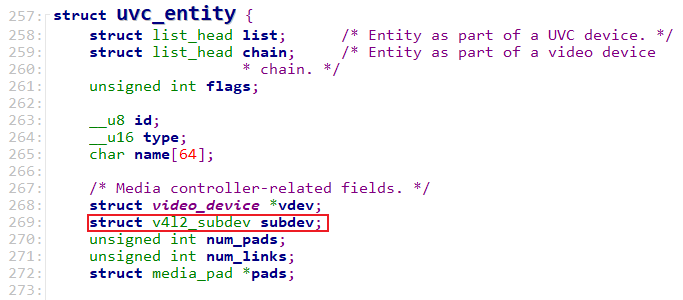

但是，这些subdev没有什么作用，它们的ops函数都是空的：

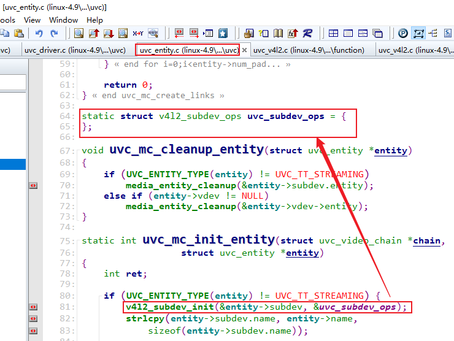


##### 3. 复杂驱动

下图是使用v853 mipi摄像头时，涉及的内部结构或内部流程：

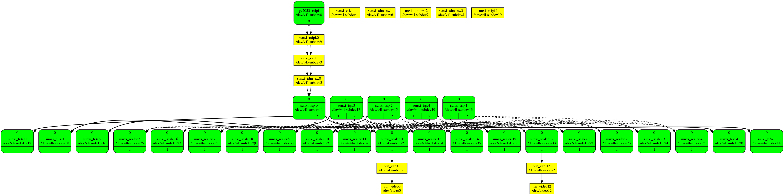

内部涉及的模块非常多，这些模块相对独立，有必要单独给这些模块编写驱动程序。

这些模块被抽象为subdev，原因有2：

* 屏蔽硬件操作的细节，有些模块是I2C接口的，有些模块是SPI接口的，它们都被封装为subdev
* 方便内核使用、APP使用：可以在内核里调用subdev的函数，也可以在用户空间调用subdev的函数：很多厂家不愿意公开ISP的源码，只能在驱动层面提供最简单的subdev，然后通过APP调用subdev的基本读写函数进行复杂的设置。

subdev结构体如下：

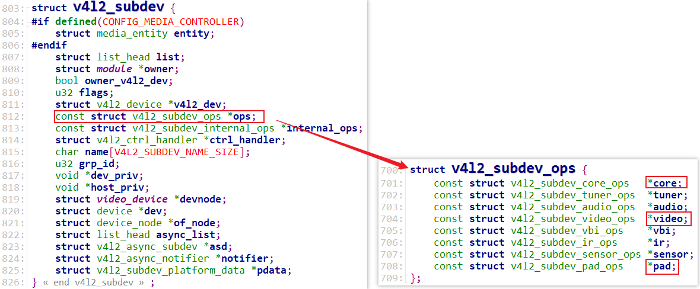

里面有各类ops结构体，比如core、tuner、audio、video等等。编写subdev驱动程序时，核心就是实现各类ops结构体的函数。

以上图中第1个模块gc2053为例，它的代码为"drivers\media\platform\sunxi-vin\modules\sensor\gc2053_mipi.c"，核心结构体如下：

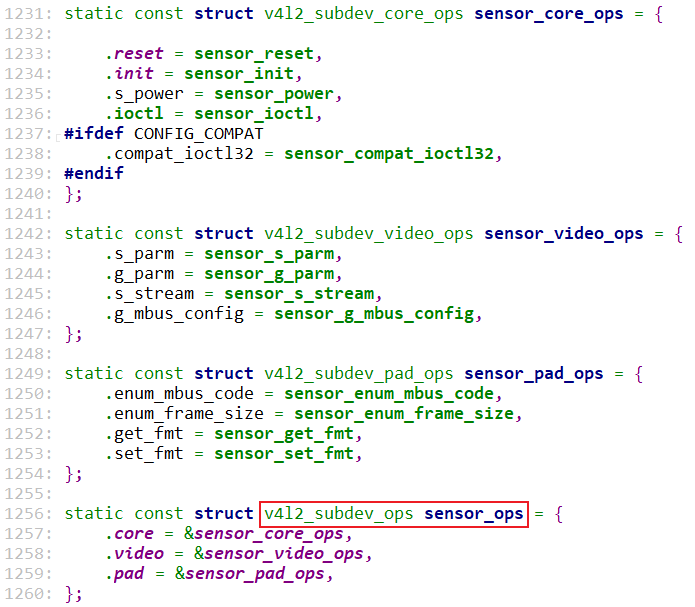

#### 4.1.2 media子系统的引入

即使我们给每一个子模块都编写了驱动程序，都构造了subdev，但是它们之间的相互关系怎么表示？如下图：

* 每一个模块都构造了subdev
* 但是，框图里黑色箭头所表示的关系如何描述？
  * 比如，从"格式解析"模块出来的数据，到底是输出到"ISP0"还是"ISP1"？用户如何选择？
  * 当我们指定"格式解析"模块输出的数据格式后，是否也要同步指定ISP0或ISP1模块的输入数据格式？

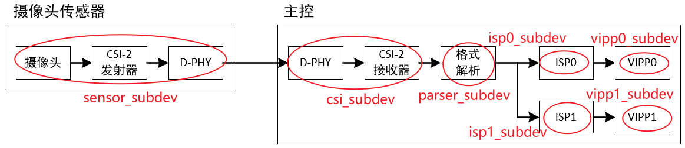

这就需要引入media子系统，简化如下：

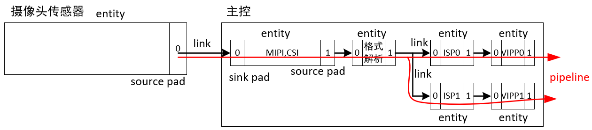

怎么操作上图的各个对象？使用subdev。subdev里含有各个对象的操作函数。

怎么表示上图的各个对象之间的关系？使用media子系统。在media子系统里，

* 每个对象都是一个media_entity
* media_entity有media_pad，可以认为是端点（不能简单认为是硬件引脚），有source pad（输出数据），sink pad（输入数据）
* media_entity之间的连接被称为media_link
* media_link仅仅表示两个media_entity之间的连接，要构成一个完整的数据通道，需要多个系列的连接，这被称为pipeline
* media子系统的作用就在于管理"拓扑关系"，就是各个对象的连接关系。


把V853的拓扑图精简一下：

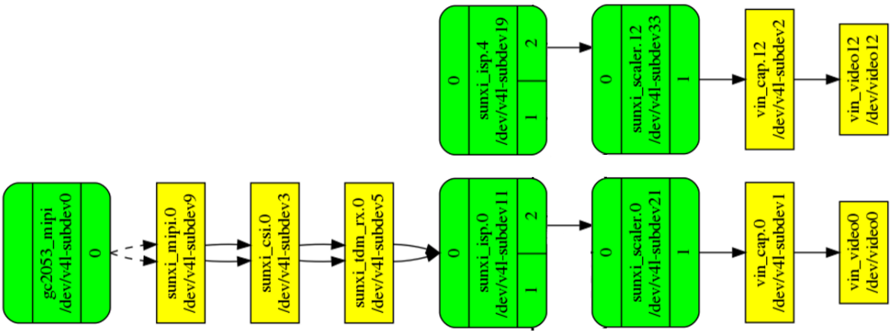

怎么表示上图的各个对象？使用media子系统，media子系统的作用在于管理"拓扑关系"，就是各个对象的连接关系。

怎么操作上图的各个对象？使用subdev。subdev里含有各个对象的操作函数。


命令示例：

```shell
media-ctl -v -l '"gc2053_mipi":0->"sunxi_mipi.0":0[1]'
v4l2-ctl -D -d /dev/v4l-subdev0
```


### 4.2 subdev概览与数据结构

#### 4.2.1 实例

以`drivers\media\platform\sunxi-vin\modules\sensor\gc2053_mipi.c`为例：

```c
sensor_probe
    /* 分配sensor_info结构体,里面含有v4l2_subdev */
    struct v4l2_subdev *sd;	
	struct sensor_info *info;

    info = kzalloc(sizeof(struct sensor_info), GFP_KERNEL);
	sd = &info->sd;

    cci_dev_probe_helper(sd, client, &sensor_ops, &cci_drv[sensor_dev_id++]);
		v4l2_i2c_subdev_init(sd, client, sensor_ops);
			v4l2_subdev_init(sd, ops);
```

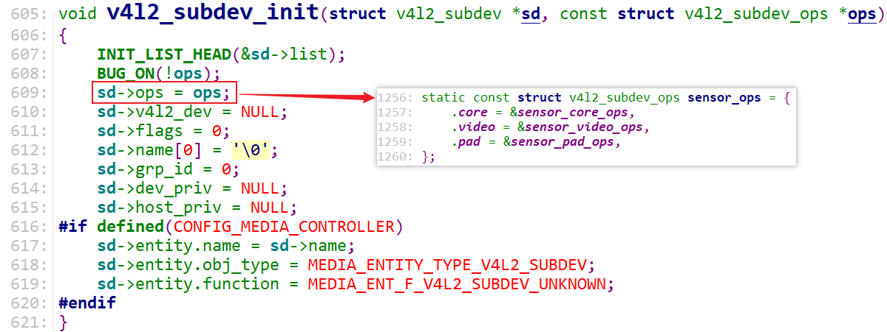

#### 4.2.2 数据结构

一个模块对应一个subdev，怎么操作这个模块？subdev里面有ops：


怎么管理多个subdev？必定是放入一个链表里：

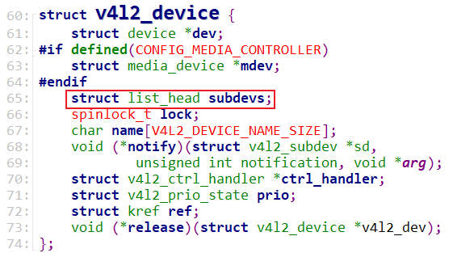


### 4.3 media子系统概览与数据结构

#### 4.3.1 拓扑结构

对于V853精简的拓扑图：


在media子系统里，怎么表示上面的各个entity的关系？以最左边2个entity为例，结构体如下：

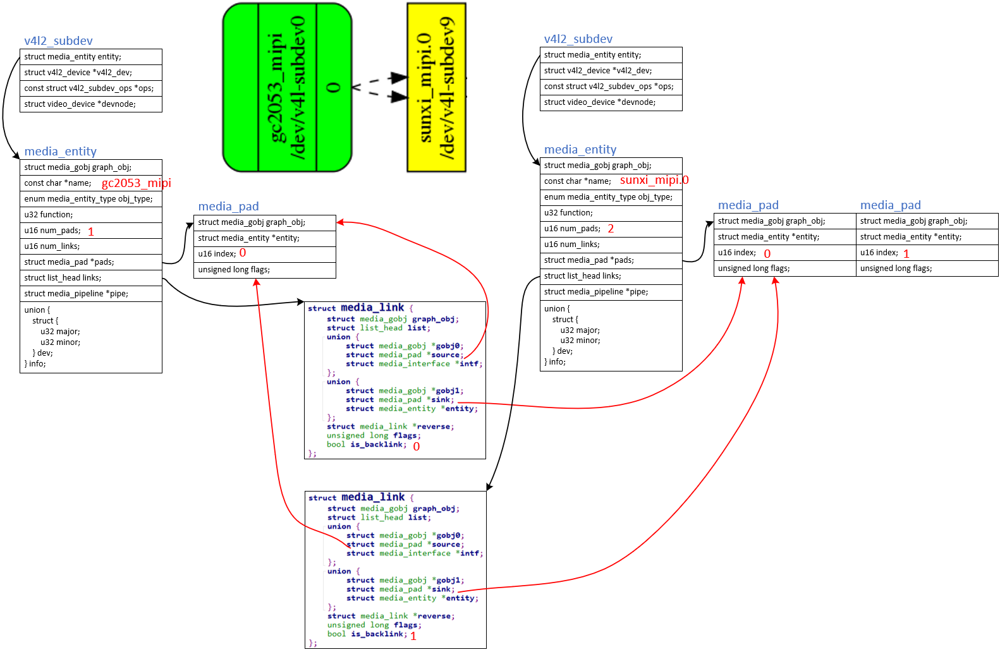


#### 4.3.2 数据结构

一个media子系统使用"struct media_device"来表示，结构体如下：

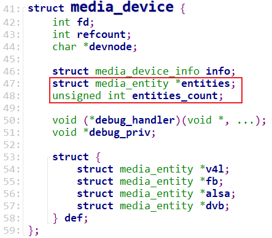

media_device里有多个entity，它使用"struct media_entity"来表示：

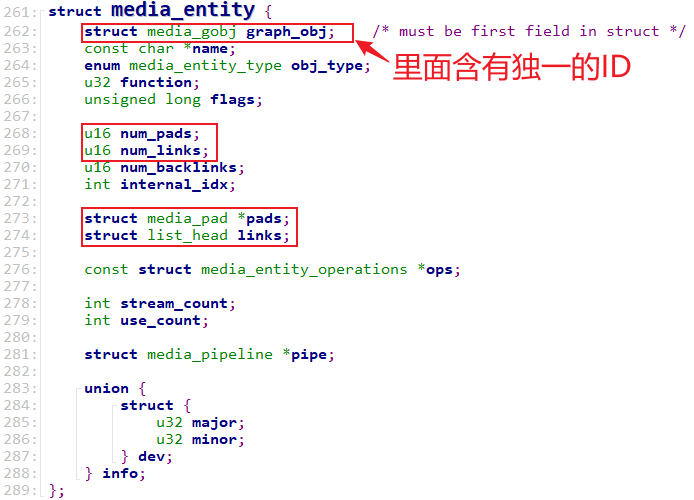

media_entity里有多个pad，它使用"struct media_pad"来表示：

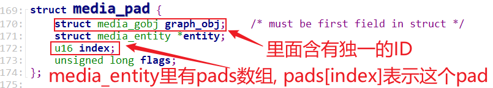

entity通过pad跟其他entity相连，这被称为link，它使用"media_link"来表示：

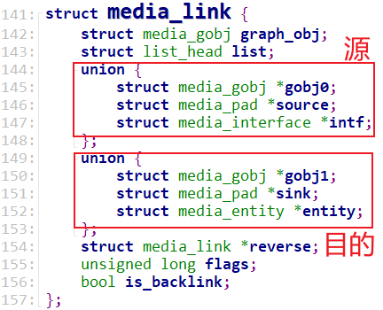

两个entity之间的连接，被称为link；多个已经使能的link构成一条完整的数据通道，这被称为pipeline。驱动程序在进行streamon操作时，有些驱动会调用"media_entity_pipeline_start"函数，类似下面的代码：

```c
ret = media_entity_pipeline_start(sensor, camif->m_pipeline);
```

第1个参数是第1个entity，第2个参数就是pipeline（它在media_entity_pipeline_start函数内部构造）。

media_entity_pipeline_start的目的，是从第1个entity开始，遍历所有的link，把已经使能的link都执行"link_validate"。

media_entity_pipeline_start内部，是按照深度优先来操作entity的，以下图为例：

* 有两条pipeline：e0->e1->e2->e3，e0->e1->e4->e5
* 先遍历e0->e1->e2->e3这条pipeline，调用e3、e2的"link_validate"
* 再遍历e0->e1->e4->e5这条pipeline，调用e5、e4的"link_validate"
* 接着处理e1，调用它的"link_validate"
* 最后处理e0，它没有sink pad，无需调用它的"link_validate"

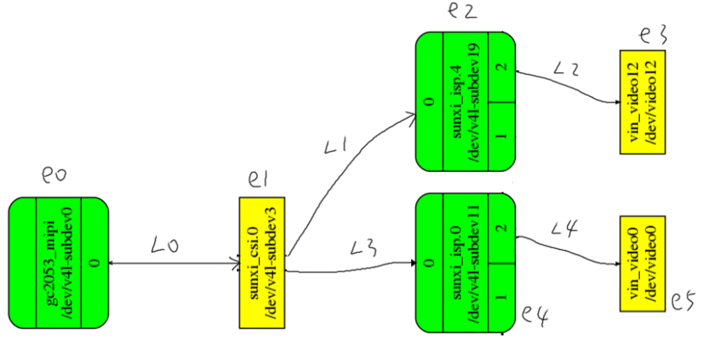


#### 4.3.3 media子系统和subdev的关系

内核空间，v4l2_subdev里含有media_entity，两者都很容易找到对方：

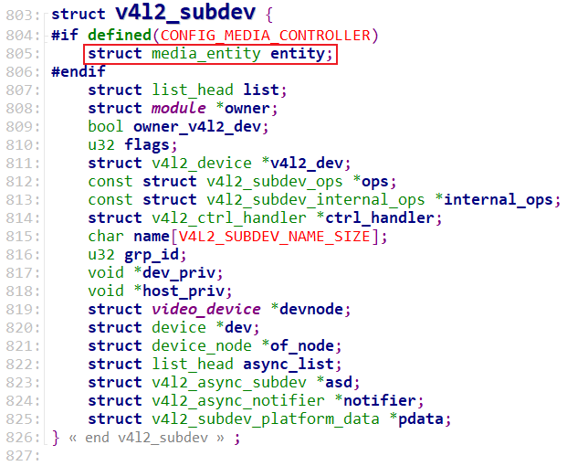

从entity找到subdev，使用以下代码：

```shell
#define media_entity_to_v4l2_subdev(ent) \
	container_of(ent, struct v4l2_subdev, entity)
```


用户空间里，怎么从entity找到对应的/dev/v4l-subdevX？参考`v4l-utils-1.20.0\utils\media-ctl\libmediactl.c`

```c
// 1. open /dev/media0
media->fd = open(media->devnode, O_RDWR);

// 2.循环调用ioctl(MEDIA_IOC_ENUM_ENTITIES), 得到每一个entity的信息
entity = &media->entities[media->entities_count];
memset(entity, 0, sizeof(*entity));
entity->fd = -1;
entity->info.id = id | MEDIA_ENT_ID_FLAG_NEXT;
entity->media = media;

// entity->info类型为: struct media_entity_desc info; 
// 里面含有major, minor
ret = ioctl(media->fd, MEDIA_IOC_ENUM_ENTITIES, &entity->info);


// 3. 使用media_get_devname_sysfs函数获得entity对应的设备节点
// 根据主设备号、次设备号在/sys/dev/char目录下找到类似这样的文件: /sys/dev/char/81:2
// 它是一个连接文件,连接到：../../devices/platform/soc/5800800.vind/video4linux/v4l-subdev0
// /dev/v4l-subdev0就是这个entity对应的设备节点
// APP的media_entity.devname[32]里就是"/dev/v4l-subdev0"
static int media_get_devname_sysfs(struct media_entity *entity);
```


### 4.4 subdev的注册与使用

#### 4.4.1 内核注册过程

subdev里含有模块的操作函数，谁调用这些函数？

* 内核调用：subdev完全可以不暴露给用户，在摄像头驱动程序内部"偷偷地"调用subdev的函数，用户感觉不到subdev的存在。
* APP调用：对于比较复杂的硬件，驱动程序应该"让用户有办法调节各类参数"，比如ISP模块几乎都是闭源的，对它的设置只能通过APP进行。这类subdev的函数，应该暴露给用户，用户可以调用它们。

在内核里，subdev的注册过程为分为2步：

* v4l2_device_register_subdev: 把subdev放入v4l2_device的链表

  ```c
  int v4l2_device_register_subdev(struct v4l2_device *v4l2_dev,
  				struct v4l2_subdev *sd);
  
  // 核心代码
  list_add_tail(&sd->list, &v4l2_dev->subdevs);
  ```

* v4l2_device_register_subdev_nodes：遍历v4l2_device链表里各个subdev，如果它想暴露给APP，就把它注册为普通字符设备

  ```c
  int v4l2_device_register_subdev_nodes(struct v4l2_device *v4l2_dev);
  
  // 调用过程如下
  v4l2_device_register_subdev_nodes
  	struct video_device *vdev;
  	vdev->fops = &v4l2_subdev_fops;
  	err = __video_register_device(vdev, VFL_TYPE_SUBDEV, -1, 1,
  					      sd->owner);
  		name_base = "v4l-subdev";
  		vdev->cdev->ops = &v4l2_fops;
  		ret = cdev_add(vdev->cdev, MKDEV(VIDEO_MAJOR, vdev->minor), 1);
  ```

  

v4l2_device_register_subdev_nodes的注册过程涉及2个结构体：

* file_operations：
  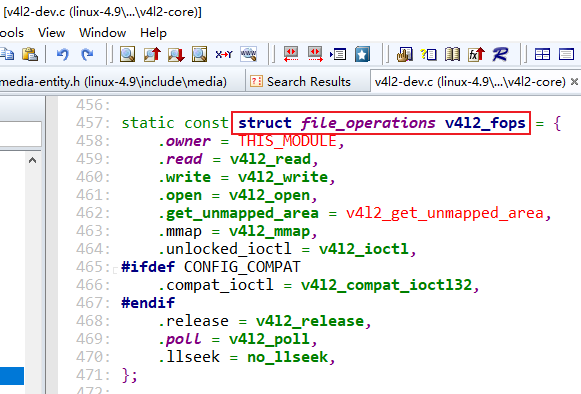

* v4l2_file_operations：
  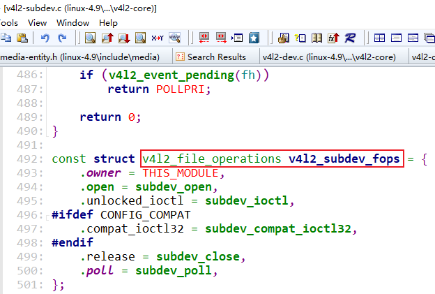


注册subdev后，内核里结构体如下：


#### 4.4.2 内核态使用subdev

可以直接调用subdev里的操作函数，也可以使用下面的宏：

```c
#define v4l2_subdev_call(sd, o, f, args...)				\
	(!(sd) ? -ENODEV : (((sd)->ops->o && (sd)->ops->o->f) ?	\
		(sd)->ops->o->f((sd), ##args) : -ENOIOCTLCMD))
```

示例：drivers\media\platform\blackfin\bfin_capture.c

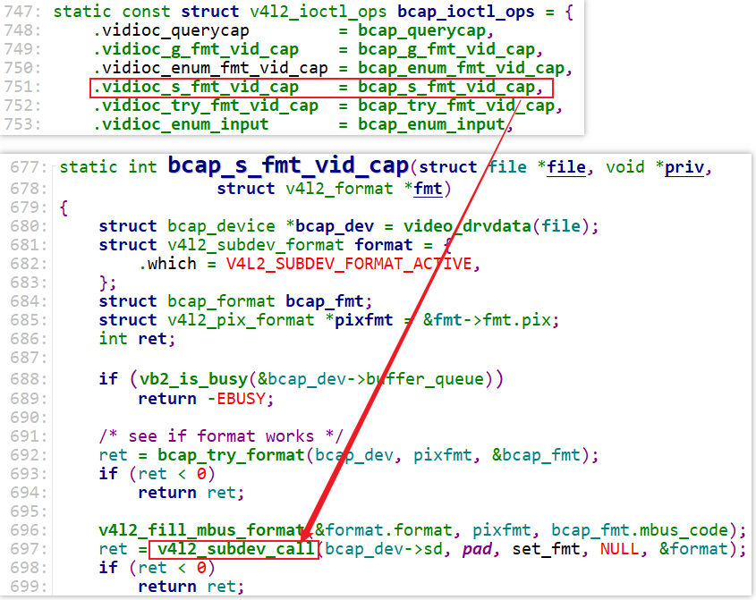


subdev的ops示例：

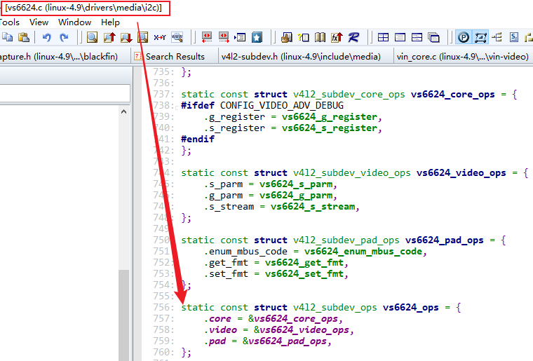


#### 4.4.3 用户态使用subdev

APP对/dev/v4l-subdev*这类的设备进行ioctl操作时，内核里流程如下：

```shell
App:   ioctl（fd, cmd, arg）
--------------
kernel: 
v4l2_fops.unlocked_ioctl, 即v4l2_ioctl
	ret = vdev->fops->unlocked_ioctl(filp, cmd, arg);
		v4l2_subdev_fops.unlocked_ioctl, 即subdev_ioctl
			video_usercopy(file, cmd, arg, subdev_do_ioctl);
```

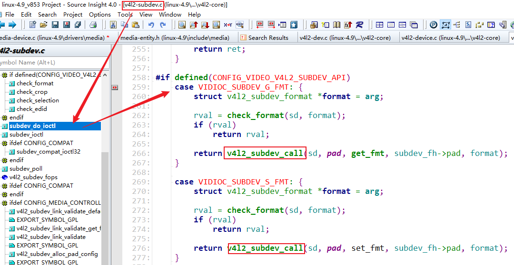


APP可以打开设备文件/dev/v4l-subdevX，执行ioctl调用驱动里面的各个ops函数，调用关系如下：

##### 1. v4l2_subdev_core_ops

* VIDIOC_SUBSCRIBE_EVENT：APP订阅感兴趣的事件，导致core->subscribe_event被调用
* VIDIOC_UNSUBSCRIBE_EVENT：APP取消兴趣，导致core->unsubscribe_event被调用
* VIDIOC_DBG_G_REGISTER：调试作用，读寄存器，导致core->g_register被调用
* VIDIOC_DBG_S_REGISTER：调试作用，写寄存器，导致core->s_register被调用
* VIDIOC_LOG_STATUS：调试作用，打印调试信息，导致core->log_status被调用

##### 2. v4l2_subdev_video_ops

* VIDIOC_SUBDEV_G_FRAME_INTERVAL：获得帧间隔，导致video->g_frame_interval被调用
* VIDIOC_SUBDEV_S_FRAME_INTERVAL：设置帧间隔，导致video->s_frame_interval被调用
* VIDIOC_SUBDEV_QUERY_DV_TIMINGS：导致video->query_dv_timings被调用
* VIDIOC_SUBDEV_G_DV_TIMINGS：导致video->g_dv_timings被调用
* VIDIOC_SUBDEV_S_DV_TIMINGS：导致video->s_dv_timings被调用


##### 3. v4l2_subdev_pad_ops

* VIDIOC_SUBDEV_G_FMT：导致pad->get_fmt被调用
* VIDIOC_SUBDEV_S_FMT：导致pad->set_fmt被调用
* VIDIOC_SUBDEV_G_CROP/VIDIOC_SUBDEV_G_SELECTION：导致pad->get_selection被调用
* VIDIOC_SUBDEV_S_CROP/VIDIOC_SUBDEV_S_SELECTION：导致pad->set_selection被调用
* VIDIOC_SUBDEV_ENUM_MBUS_CODE：导致pad->enum_mbus_code被调用
* VIDIOC_SUBDEV_ENUM_FRAME_SIZE：导致pad->enum_frame_size被调用
* VIDIOC_SUBDEV_ENUM_FRAME_INTERVAL：导致pad->enum_frame_interval被调用
* VIDIOC_G_EDID：导致pad->get_edid被调用
* VIDIOC_S_EDID：导致pad->set_edid被调用
* VIDIOC_SUBDEV_DV_TIMINGS_CAP：导致pad->dv_timings_cap被调用
* VIDIOC_SUBDEV_ENUM_DV_TIMINGS：导致pad->enum_dv_timings被调用

驱动内部调用：

* v4l2_subdev_link_validate：导致pad->link_validate被调用
* v4l2_subdev_alloc_pad_config：导致pad->init_cfg被调用


### 4.5 media子系统的注册与使用

#### 4.5.1 内核注册过程

总图如下：


##### 1. 两个层次

media子系统的注册分为2个层次：

* 描述自己的media_entity：各个subdev里含有media_entity，但是多个media_entity之间的关系由更上层的驱动决定
* 描述media_entity之间的联系：更上层的、统筹的驱动：它知道各个subdev即各个media_entity之间的联系：link

##### 2. 四个步骤

media子系统的注册分为4个步骤：

* 描述自己：各个底层驱动构造subdev时，顺便初始里面的media_entity：比如这个media_entity有哪些pad

  ```c
  // 示例
  // drivers\media\platform\sunxi-vin\modules\sensor\gc2053_mipi.c: cci_dev_probe_helper
  // drivers\media\platform\sunxi-vin\vin-cci\cci_helper.c: cci_media_entity_init_helper
  media_entity_pads_init(&sd->entity, SENSOR_PAD_NUM, si->sensor_pads);
  ```

* 注册自己：底层或上层注册subdev时，顺便注册media_entity：把media_entity记录在media_device里

  ```c
  // 示例
  // drivers\media\platform\sunxi-vin\vin.c
  vin_md_register_entities
      v4l2_device_register_subdev
      	struct media_entity *entity = &sd->entity;
      	err = media_device_register_entity(v4l2_dev->mdev, entity);
  ```

  

* 和别人建立联系：subdev之上的驱动程序决定各个media_entity如何连接：比如调用media_create_pad_link创建连接

  ```c
  // 示例
  // drivers\media\platform\sunxi-vin\vin.c
  ret = media_create_pad_link(source, SCALER_PAD_SOURCE,
  						sink, VIN_SD_PAD_SINK,
  						MEDIA_LNK_FL_ENABLED);
  ```

  

* 暴露给APP使用：subdev之上的驱动程序注册media_device: media_device里已经汇聚了所有的media_entity

  ```c
  // 示例
  // drivers\media\platform\sunxi-vin\vin.c
  vin_probe
      ret = media_device_register(&vind->media_dev);
  ```

  

在内核里，media子系统的注册过程为：

```shell
media_device_register
	__media_device_register
		struct media_devnode *devnode;
		devnode->fops = &media_device_fops;
		ret = media_devnode_register(mdev, devnode, owner);
        	cdev_init(&devnode->cdev, &media_devnode_fops);
        	ret = cdev_add(&devnode->cdev, MKDEV(MAJOR(media_dev_t), devnode->minor), 1);
```

上述注册过程涉及2个结构体：

* file_operations：
  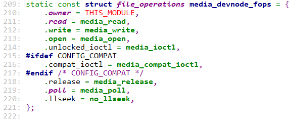

* media_file_operations：
  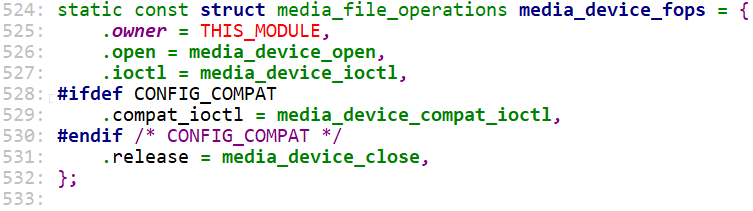


#### 4.5.2 APP使用media子系统

APP使用media子系统时，除了open之外，就只涉及5个ioctl：

* MEDIA_IOC_DEVICE_INFO
* MEDIA_IOC_ENUM_ENTITIES
* MEDIA_IOC_ENUM_LINKS
* MEDIA_IOC_SETUP_LINK
* MEDIA_IOC_G_TOPOLOGY

这5个ioctl将导致内核中如下函数被调用（drivers\media\media-device.c）：

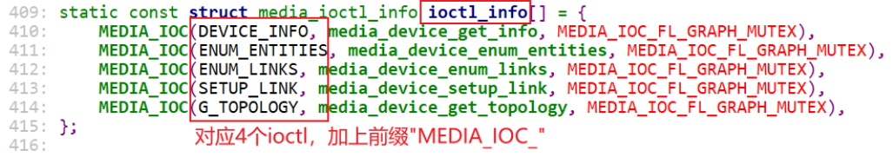


APP对/dev/media0这类的设备进行ioctl操作时，内核里流程如下：

```shell
App:   ioctl
--------------
kernel: 
media_devnode_fops.unlocked_ioctl, 即media_ioctl
	__media_ioctl(filp, cmd, arg, devnode->fops->ioctl);
		media_device_ioctl
			const struct media_ioctl_info *info;
			info = &ioctl_info[_IOC_NR(cmd)];
			ret = info->arg_from_user(karg, arg, cmd);
			ret = info->fn(dev, karg);
			ret = info->arg_to_user(arg, karg, cmd);
```

核心在于ioctl_info：

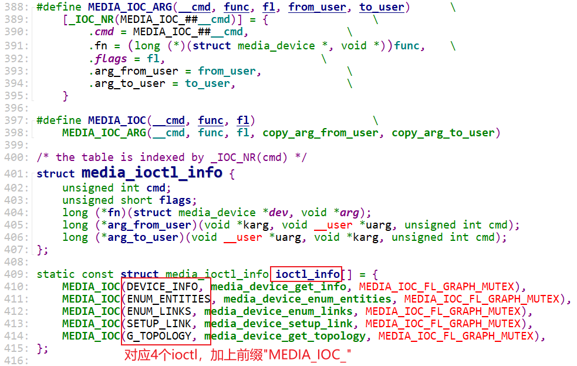


##### 1.MEDIA_IOC_DEVICE_INFO

这个ioctl被用来获得/dev/mediaX的设备信息，设备信息结构体如下
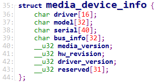

APP代码如下：

```c
	memset(&media->info, 0, sizeof(media->info)); // struct media_device_info info;
	ret = ioctl(media->fd, MEDIA_IOC_DEVICE_INFO, &media->info);
```

驱动中对应核心代码如下：

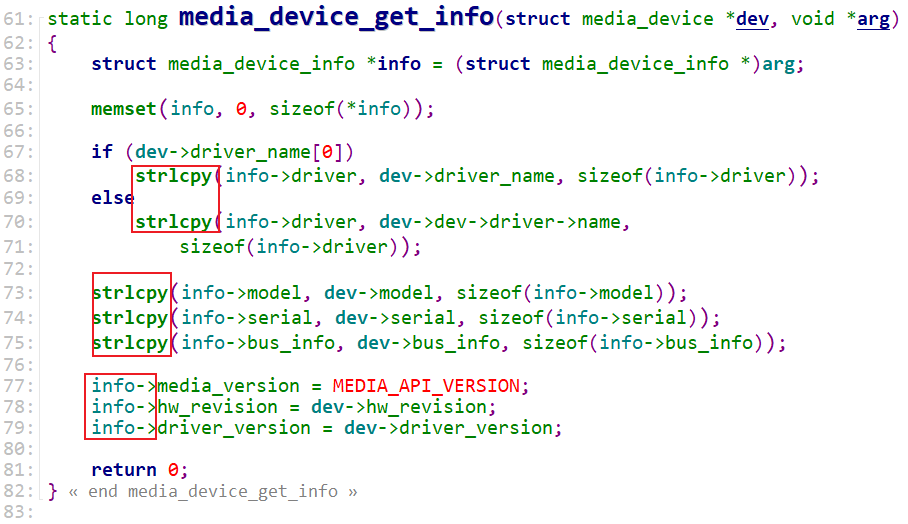


##### 2. MEDIA_IOC_ENUM_ENTITIES

这个ioctl被用来获得指定entity的信息，APP参考代码为
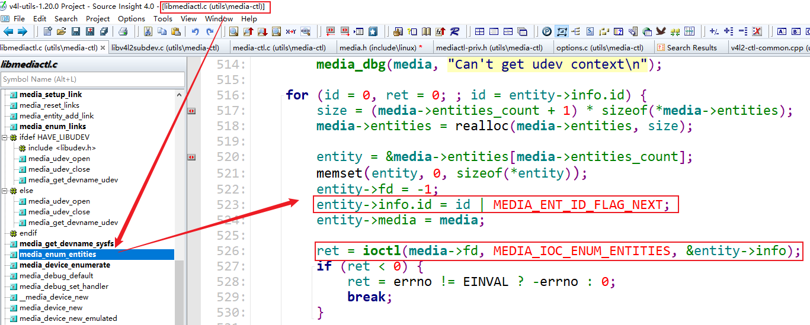

驱动中对应核心代码如下：

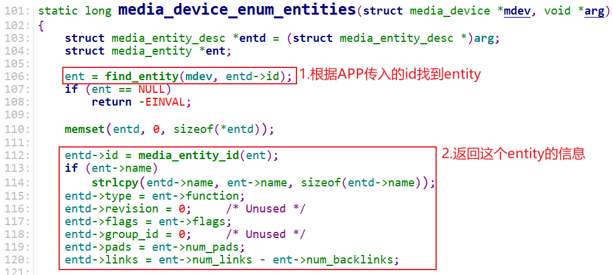


##### 3. MEDIA_IOC_ENUM_LINKS

这个ioctl被用来枚举enity的link，APP参考代码为
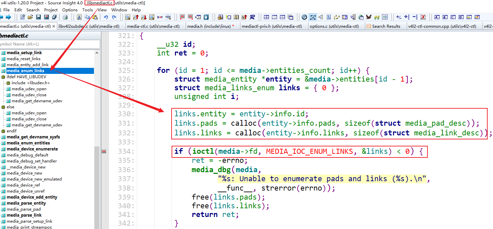

驱动中对应核心代码如下：

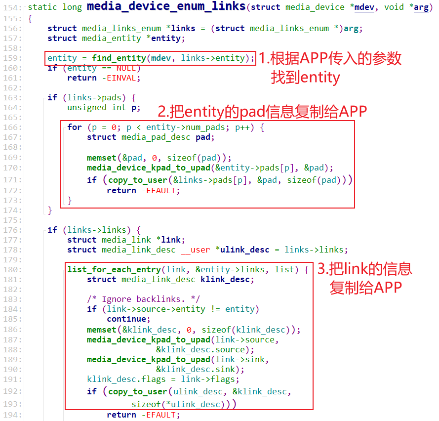


##### 4. MEDIA_IOC_SETUP_LINK

这个ioctl被用来设置link，把源pad、目的pad之间的连接激活（active），或者闲置（inactive），APP示例代码为：
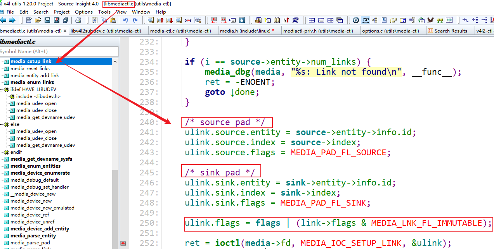

APP传入的flags的取值有2种：

* 0：闲置link
* 1：激活link

内核里link的flag有如下取值：


如果这个link的flag不是MEDIA_LINK_FL_IMMUTABLE的话，就可以去更改它的bit0状态：激活或闲置。


驱动中对应核心代码如下：

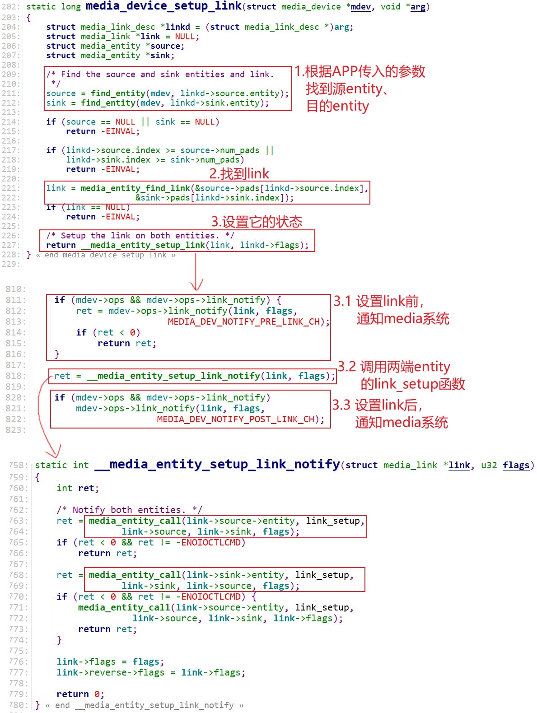

##### 5. MEDIA_IOC_G_TOPOLOGY

这个ioctl被用来获得整体的拓扑图，包括entities、interfaces、pads、links的信息，示例代码如下

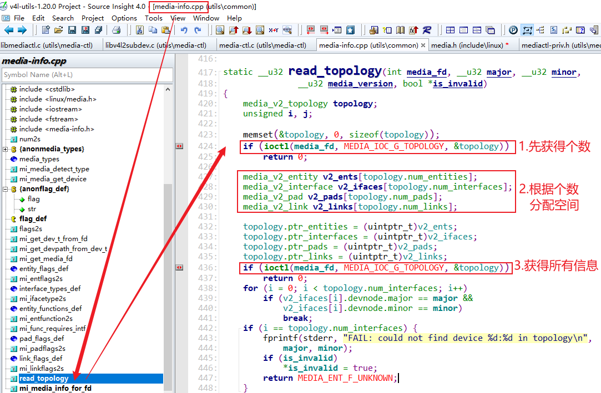

驱动中对应核心代码如下，只要APP提供了对应的buffer，它就可以复制对应的信息，比如entities、interfaces、pads、links的信息：

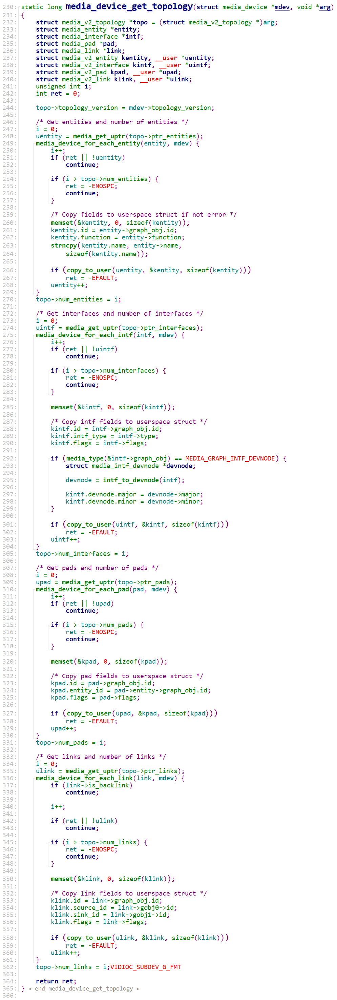

* 

### 4.6 v4l2-utils使用详解

v4l2-utils中含有多个APP，比如：

- [DVBv5_Tools](https://www.linuxtv.org/wiki/index.php/DVBv5_Tools): tools to scan, zap and do other neat things with DVB devices;
- ir-keytable: Dump, Load or Modify ir receiver input tables;
- ir-ctl: A swiss-knife tool to handle raw IR and to set lirc options;
- media-ctl: Tool to handle media controller devices;
- qv4l2: QT v4l2 control panel application;
- v4l2-compliance: Tool to test v4l2 API compliance of drivers;
- v4l2-ctl: tool to control v4l2 controls from the cmdline;
- v4l2-dbg: tool to directly get and set registers of v4l2 devices;
- v4l2-sysfs-path: checks the media devices installed on a machine and the corresponding device nodes;
- xc3028-firmware: Xceive XC2028/3028 tuner module firmware manipulation tool;
- cx18-ctl: tool to handle cx18 based devices (deprecated in favor of v4l2-ctl);
- ivtv-ctl: tool to handle ivtv based devices (deprecated in favor of v4l2-ctl);
- rds-ctl: tool to handle RDS radio devices;
- decode_tm6000: ancillary tool to decodes tm6000 proprietary format streams;
- cec-ctl: tool to control CEC devices from the command line;
- cec-follower: tool used to emulate CEC followers;
- cec-compliance: tool to test CEC API compliance of drivers and remote CEC devices;


media-ctl使用方法为：

```shell
media-ctl --help
media-ctl [options]
-d, --device dev        Media device name (default: /dev/media0)
                        If <dev> starts with a digit, then /dev/media<dev> is used.
                        If <dev> doesn't exist, then find a media device that
                        reports a bus info string equal to <dev>.
-e, --entity name       Print the device name associated with the given entity
-V, --set-v4l2 v4l2     Comma-separated list of formats to setup
    --get-v4l2 pad      Print the active format on a given pad
    --get-dv pad        Print detected and current DV timings on a given pad
    --set-dv pad        Configure DV timings on a given pad
-h, --help              Show verbose help and exit
-i, --interactive       Modify links interactively
-l, --links links       Comma-separated list of link descriptors to setup
    --known-mbus-fmts   List known media bus formats and their numeric values
-p, --print-topology    Print the device topology. If an entity
                        is specified through the -e option, print
                        information for that entity only.
    --print-dot         Print the device topology as a dot graph
-r, --reset             Reset all links to inactive
-v, --verbose           Be verbose

Links and formats are defined as
        links           = link { ',' link } ;
        link            = pad '->' pad '[' flags ']' ;
        pad             = entity ':' pad-number ;
        entity          = entity-number | ( '"' entity-name '"' ) ;

        v4l2            = pad '[' v4l2-properties ']' ;
        v4l2-properties = v4l2-property { ',' v4l2-property } ;
        v4l2-property   = v4l2-mbusfmt | v4l2-crop | v4l2-interval
                        | v4l2-compose | v4l2-interval ;
        v4l2-mbusfmt    = 'fmt:' fcc '/' size ; { 'field:' v4l2-field ; } { 'colorspace:' v4l2-colorspace ; }
                           { 'xfer:' v4l2-xfer-func ; } { 'ycbcr-enc:' v4l2-ycbcr-enc-func ; }
                           { 'quantization:' v4l2-quant ; }
        v4l2-crop       = 'crop:' rectangle ;
        v4l2-compose    = 'compose:' rectangle ;
        v4l2-interval   = '@' numerator '/' denominator ;

        rectangle       = '(' left ',' top, ')' '/' size ;
        size            = width 'x' height ;

where the fields are
        entity-number   Entity numeric identifier
        entity-name     Entity name (string)
        pad-number      Pad numeric identifier
        flags           Link flags (0: inactive, 1: active)
        fcc             Format FourCC
        width           Image width in pixels
        height          Image height in pixels
        numerator       Frame interval numerator
        denominator     Frame interval denominator
        v4l2-field      One of the following:
                        any
                        none
                        top
                        bottom
                        interlaced
                        seq-tb
                        seq-bt
                        alternate
                        interlaced-tb
                        interlaced-bt
        v4l2-colorspace One of the following:
                        default
                        smpte170m
                        smpte240m
                        rec709
                        unknown
                        470m
                        470bg
                        jpeg
                        srgb
                        oprgb
                        bt2020
                        raw
                        dcip3
        v4l2-xfer-func  One of the following:
                        default
                        709
                        srgb
                        oprgb
                        smpte240m
                        none
                        dcip3
                        smpte2084
        v4l2-quant      One of the following:
                        default
                        full-range
                        lim-range
```


v4l2-ctl使用方法如下：

```shell
v4l2-ctl --help

General/Common options:
  --all              display all information available
  -C, --get-ctrl <ctrl>[,<ctrl>...]
                     get the value of the controls [VIDIOC_G_EXT_CTRLS]
  -c, --set-ctrl <ctrl>=<val>[,<ctrl>=<val>...]
                     set the value of the controls [VIDIOC_S_EXT_CTRLS]
  -D, --info         show driver info [VIDIOC_QUERYCAP]
  -d, --device <dev> use device <dev> instead of /dev/video0
                     if <dev> starts with a digit, then /dev/video<dev> is used
                     Otherwise if -z was specified earlier, then <dev> is the entity name
                     or interface ID (if prefixed with 0x) as found in the topology of the
                     media device with the bus info string as specified by the -z option.
  -e, --out-device <dev> use device <dev> for output streams instead of the
                     default device as set with --device
                     if <dev> starts with a digit, then /dev/video<dev> is used
                     Otherwise if -z was specified earlier, then <dev> is the entity name
                     or interface ID (if prefixed with 0x) as found in the topology of the
                     media device with the bus info string as specified by the -z option.
  -E, --export-device <dev> use device <dev> for exporting DMA buffers
                     if <dev> starts with a digit, then /dev/video<dev> is used
                     Otherwise if -z was specified earlier, then <dev> is the entity name
                     or interface ID (if prefixed with 0x) as found in the topology of the
                     media device with the bus info string as specified by the -z option.
  -z, --media-bus-info <bus-info>
                     find the media device with the given bus info string. If set, then
                     -d, -e and -E options can use the entity name or interface ID to refer
                     to the device nodes.
  -h, --help         display this help message
  --help-all         all options
  --help-io          input/output options
  --help-meta        metadata format options
  --help-misc        miscellaneous options
  --help-overlay     overlay format options
  --help-sdr         SDR format options
  --help-selection   crop/selection options
  --help-stds        standards and other video timings options
  --help-streaming   streaming options
  --help-subdev      sub-device options
  --help-tuner       tuner/modulator options
  --help-vbi         VBI format options
  --help-vidcap      video capture format options
  --help-vidout      vidout output format options
  --help-edid        edid handling options
  -k, --concise      be more concise if possible.
  -l, --list-ctrls   display all controls and their values [VIDIOC_QUERYCTRL]
  -L, --list-ctrls-menus
                     display all controls and their menus [VIDIOC_QUERYMENU]
  -r, --subset <ctrl>[,<offset>,<size>]+
                     the subset of the N-dimensional array to get/set for control <ctrl>,
                     for every dimension an (<offset>, <size>) tuple is given.
  -w, --wrapper      use the libv4l2 wrapper library.
  --list-devices     list all v4l devices. If -z was given, then list just the
                     devices of the media device with the bus info string as
                     specified by the -z option.
  --log-status       log the board status in the kernel log [VIDIOC_LOG_STATUS]
  --get-priority     query the current access priority [VIDIOC_G_PRIORITY]
  --set-priority <prio>
                     set the new access priority [VIDIOC_S_PRIORITY]
                     <prio> is 1 (background), 2 (interactive) or 3 (record)
  --silent           only set the result code, do not print any messages
  --sleep <secs>     sleep <secs>, call QUERYCAP and close the file handle
  --verbose          turn on verbose ioctl status reporting
```


